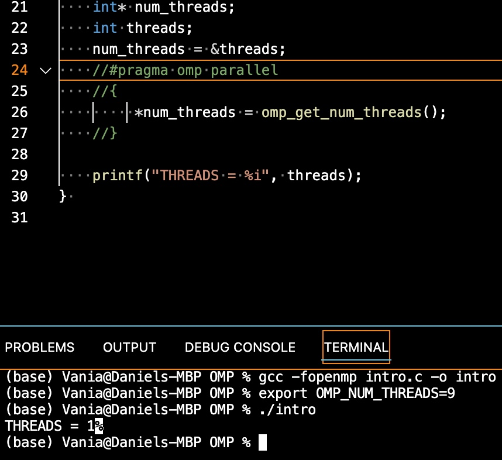
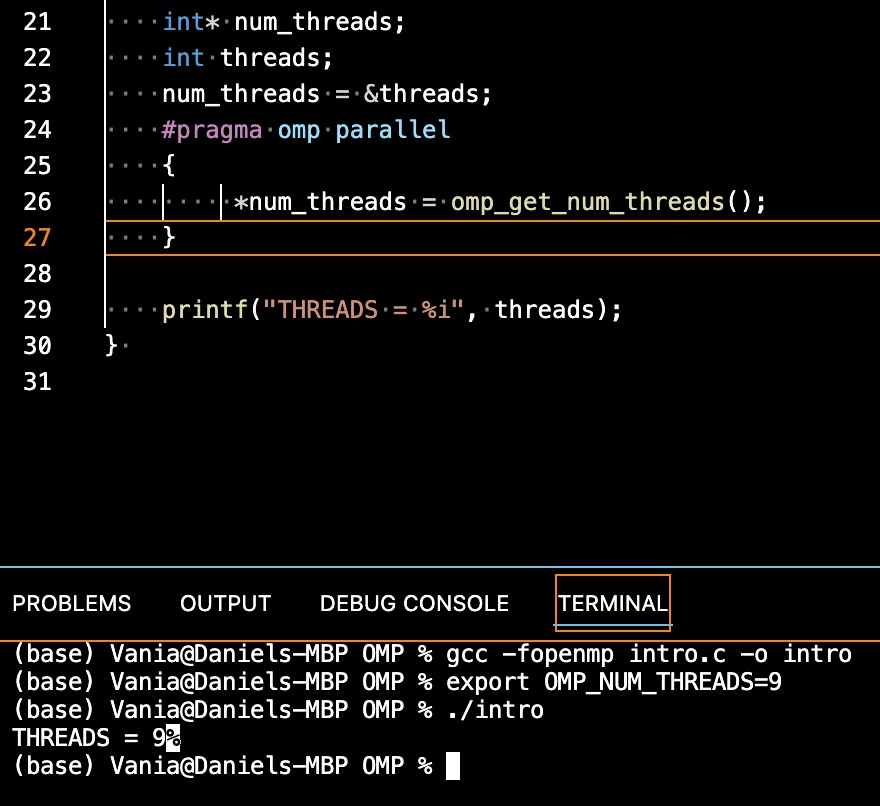
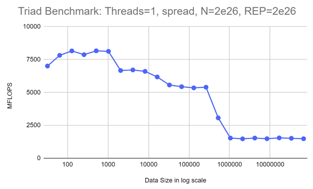
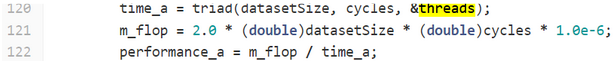
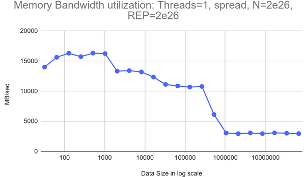
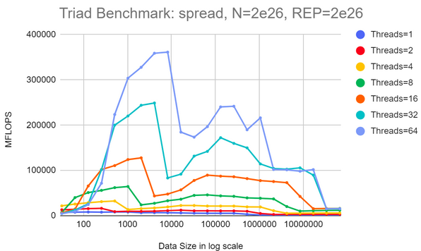
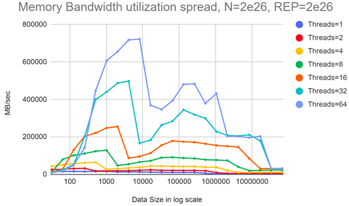
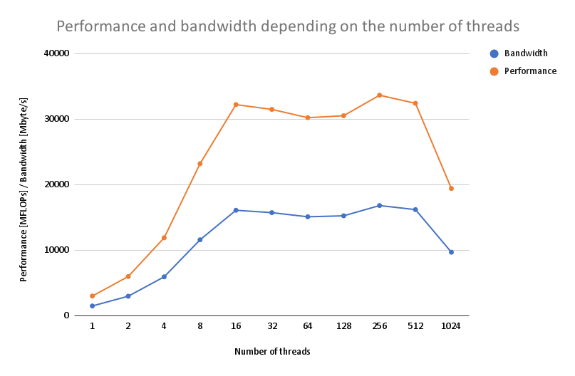
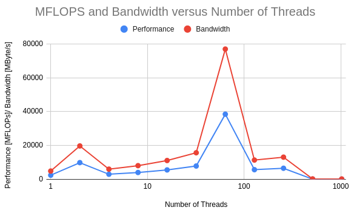

# Assignment 1 Report
**Group: 104**

**Assignment1:**

For this assignment, we analysed the performance of the vector triad benchmark, by performing several tests on a Rome2 architecture. Parameters such as size of vectors, number of threads and thread allocation were modified to identify their effect over performance. The tested formula is as follows:

`a[i] = b[i]+ c[i] * d[i]`

**GENERAL QUESTIONS**

**A)**  Two variables, **N** and **REP** are retrieved from user input (and tested to see if they fall within the specified range). The former determines the size of the vector and the latter number of repetions for the vector triad multiplication. Taking a look at line 116: 

`while (datasetSize <= N && cycles > 1)`

the predefined variables **datasetSize(=32)** and **cycles(=10**) are being compared with the introduced arguments _in the first iteration_ of this loop. Now here, N has also another interpretation, namely an upper bound for the vector size, and for each vector size we must guarantee at least one round of execution for computing vector a. 

    `   cycles = REP / datasetSize;

        time_a = triad(datasetSize, cycles, &threads);
        m_flop = 2.0 * (double)datasetSize * (double)cycles * 1.0e-6;
        performance_a = m_flop / time_a;

        printf("| %12ld | %12d | %12.2f | %12ld |\n", datasetSize, threads, performance_a, cycles);

        datasetSize *= 2; //increase the size to 64, 128, 256, 1024, 2048, 4096....
    `

Once we enter the loop, **cycles** is redefined as the ratio between the number of repetitions and datasetSize, to guarantee that we execute N computations at each vector length, which allows us to compare performance across sizes.

While accessing the while loop (caller), we are calling the function **“triad”** (the callee):

`double triad (const long N, const long REP, int *numThreads)`

It’s in this function where the vectors a,b,c,d are constructed, with size N and number of iterations REP. With each iteration from the above loop, we are modifying the variables **datasetSize and cycles**, doubling the value of datasetSize until we reached the upper limit N(introduced by user), and recomputing the ratio cycles, only to be then passed as arguments to the callee function, meaning that with each call the vector size and number or iterations are being changed. 

One can observe that in the formula (from triad()):
a[j] = b[j] + c[j] * d[j] 
There are two arithmetic operations (one multiplication	and one addition). Moreover, this instruction is executed inside a nested loop: the inner loop runs N times, and the outer is executed REP times. Therefore, the total number of floating point operations (2) are performed N*REP times. Recall that triad is being called with parameters datasetSize and cycles, so N and REP have these values assigned, hence the number of floating point operations computed into the loop, denoted by m_flop is equal to:
2* datasetSize*cycles. Since we are counting per million, we multiply by 1*10^-6 to get the result in millions of operations. 

**B)** As mentioned above, triad takes as parameters two const long datatypes, N and REP, as well as a pointer to an integer which stores the address of the number of threads. 
N = Determines the size of the vectors
REP = how many times to recompute vector A.

Triad completes by returning a variable of type double named time_spent, indicating how much time was spent on the _. computation of vector A for each of the vector lenghts N a certain number of times REP ._ 

**C)** We use `#pragma omp parallel` to create a parallel region where threads can be spanned. At line 36, we assign to the **numThreads** pointer the number of threads so that it can be stored in the integer variable **threads**. If we omit this clause, then the **threads** will be one, despite setting the environment value to another value. The results can be observed on the images below.

**D)** aligned_loc() is a function introduced by the new C11 standard. It allows to allocate memory spaces with given alignments greater than those admitted by malloc. This function has the following structure: 

`void *aligned_alloc(size_t __alignment, size_t __size)`

 
The requirements to use it are:
-  the size (second argument) requested must be an integral multiple of the alignment (first argument) and 
-  the value of alignment should be a valid alignment supported by the implementation.

 Failure to meet either of them results in undefined behaviour.

In the code, the space allocated for each vector is computed as 

`N*sizeof(double)`. 

Since the minimum value that N can take is 32 (the first iteration of the while loop on line 116 starts with datasetSize set to 32, which is passed as an argument to triad), and sizeof(double), a constant factor, equals 8 bytes. This results in spaces of size 256x bytes (x is an integer factor, as we keep doubling N with each while-loop iteration as mentioned above).

Because of the first condition, 4096 must be an integral multiple of the assigned size, which requires that the variable N to be bigger than 256 (and a power of 2). The idea is to have allocations that are page-size aligned, and this only works when the allocation size is larger than 4096. 

For sizes <=256, there are two options: readjust the alignment or replace `aligned_alloc` with `malloc` for memory allocation with smaller alignments. 

The advantage of using `aligned_alloc` in this routine, is to prevent **false sharing**. While accessing memory, CPU fetches full cache lines, and if multiple threads write to the same line, synchronization can become costly. To prevent two variables from being located in the same cache line, one has to align them to have enough space between them (which is also why a big alignment is used in this routine). This guarantees that variables accessed by different threads are located at different cache lines. 

**E)** As discussed in the lecture, when we are trying to optimise for NUMA architecture it is better to parallelise the initialisation of the vectors in the same way that they are later accessed, meaning that the vectors are distributed across locality domains with the first-touch allocation policy. By doing it this way, we reduce the latency and improve the performance regarding memory fetching operations. The static scheduler is used to guarantee that the working load is distributed uniformly across threads on a round-robin fashion, helping to maximise the memory locality, while also offering a deterministic behaviour. 

**F)** This code section runs several iterations of the loop that is wrapped between the time measurement points. This serves as a warmup, because by running this loop before we proceed with the time evaluation, we can reduce the negative effects of cache misses and overheads from setting up the pipelines. By doing so, the obtained results are a more accurate reflection of our object of study, which in this case is the memory bandwidth.  

**G)** When using a parallel region, OpenMP automatically waits for all threads to finish before execution continues (implicit barrier). Furthermore, there is also a synchronization point after each “omp for” loop, implying that threads need to wait until each of them has finished their respective tasks. Since there are no dependencies in the loop, or potential data races, synchronization is not needed after the loop, hence we disable this by using nowait, which also reduces the idle time for each thread and increase performance, thus our results wont' include any synchronization effect and offer a better picture of the ongoing process. 

On another note, the parallel region in line 65: 

` #pragma omp parallel
 {
    for (long i=0; i < REP; i++)
 #pragma omp for schedule(static) nowait
        for (long j=0; j<N; j++)
            a[j] = b[j]+c[j]*d[j];
 }
`
spans several threads (**threads**) across this block thanks to `#pragma omp parallel`. At the first for-loop we only indicate how many times to repeat the subsequent loop, so no parallelising is done here. Therefore, the only thing remaining to do is to distribute the workload from the 2nd for-loop across the existing threads. Notice that the parallel region is created outside the loop that calculates vector a. If instead we create the parallel region inside the REP loop with `#pragma omp parallel for `, the **nowait** clause isn't compatible with the compiler, so that increases the time_spent and hence performance has smaller values. Another factor to consider is the job allocation across threads. We tested a small version of this region to observe how the workload was distributed. 

´

     // Beginning of parallel region 
    #pragma omp parallel 
    
    for (int j=0; j<6; j++)
    #pragma omp for schedule(static) nowait
        for(int i=0; i<30; i++)
            printf("Hello World... from thread = %d\n", 
               omp_get_thread_num());  
    // Ending of parallel region 
} 

´

`

    int main(int argc, char* argv[]) 
{ 
  
  
    
    for (int j=0; j<6; j++)
    #pragma omp parallel for schedule(static) //nowait
        for(int i=0; i<30; i++)
            printf("Hello World... from thread = %d\n", 
               omp_get_thread_num());  
    // Ending of parallel region 
} 

`
The results show (see images below), that when creating a parallel region outside the loop, big chunks are allocated to threads(the default scheduler is static), compared to using `pragma omp parallel for `, where the chunks are smaller and switching between threads causes more overhead. One strategy would be to try to set the chunk sizes before hand to avoid unnecessary thread calls 

**H)** The checksum function could also be useful to compare floating point precision across different systems. One could decrease the tolerance defined (in this case is 0.1), and test which architectures are more suitable for computations that require accurate results. 

**2. EXPERIMENTS AND MEASUREMENTS**

**A)** The plot below is obtained from the AMD Rome architecture, with 1 thread. The highest performance obtained was 8163.85 MFLOPS for 512 vector datasize. The graph is on log scale for the data sizes. Jumps in the performance, are visible in the graph, which account for the cache levels are visible through dramatic drops in operations per second.

**B)** In the formula for the mflops calculation seen below, the first term factor 2.0 accounts for the number of operations i.e an addition and a multiplication. Since we are now calculating memory bandwidth utilization with simplifications applied, we can say that we are doing 3 loads and one store. This in total is 4 operations. Thus, simply multiplying the “m_flop” values by 2.0 will give us the required memory bandwidth utilization.

With the logic provided above, for 1 thread and the rest of the parameters and system architecture which is the same as that of question 2a, we get the following graph:

The highest speed again is obtained for data size 512 and the speed is 16327.7 MB/sec.

**C)** Using the reference from (Moyer, 2021) we find that the AMD ROME system has eight 3,200-MHz memory channels, and allows 8 bytes of load/store per cycle/second per channel. When we carry out the multiplication to get the theoretical maximum memory bandwidth (tmmb), we get:

tmmb = 3200MHz*8 channels*8bytes/second = 204800Mbytes/second
=> **tmmb= 204.8Gbytes/second**

When compared to our simplified, calculated maximum memory bandwidth the result was 16327.7 MB/sec i.e 16.3277Gbytes/sec. There is an extremely low value as compared to the theoretical maximum. The difference can be accounted for through multiple reasons. Firstly, the theoretical maximum is likely never achieved, especially with just 1 thread because it is hard to saturate the bandwidth with just one basic processor. The calculation here is also a great simplification only loosely taking cpu operation speed into account and not the actual memory speed, memory channels, architectures or other nuances into consideration. 
It will be noticed later that when using more threads we are even able to cross the simplified calculation of the memory bandwidth limit, which shows that the limit calculated above, by doubling the flops, was a very loose estimate from the start. We were also able to see from part 2d, that the system is compute bound rather than memory bound so using the compute operations to estimate the load/store speed limit was a large over-estimation.

**D)** Similar to figure 2. Below we show plots for speed and memory benchmarks on the same AMD Rome system, but with an increasing number of threads. The other specifications are the same as that for question 2a. 

In the graph above we see that the computational operations per second greatly increase with the number of threads showing the system is in a memory bound state. We also see that the trend of increasing speed is sustained similarly to the graph in Figure 2 given in the assignment. The speed goes up till a certain data-size which corresponds to the cache limits, and then goes down as the next cache needs to be accessed to retrieve data, and finally when the data is too big for even the caches it must be retrieved from memory which makes the system memory bound, causing the computational speeds to fall to the same values for all the threads used.

In the memory bandwidth graph above we see that for 64 threads the speed is 722.5Gbytes/second, which is more than 3 times the theoretical maximum limit calculated before from the specifications. This shows that the calculations used for the simplified limit found from doubling the FLOPS are extremely approximate, and does not mean that with threading we can break the maximum limit found from the hardware specifications. 

**E)** To allow for scaling experiments, we assign datasetSize = N (introduced by the user), and remove the while loop that was modifying this variable on the previous assignments. We declare **threads** as a global variable and then redefine the number of repetions as the ratio between **REP** and **number of threads** (the pointer to threads), to have stable measurements when there are few threads and to be consistent with the repetions scheme from the previous tasks. We also adjusted the formula for mflops where **cycles** is now replaced for **REP/threads**. From task 2.d, we observed that at N=2^26 the data is loaded and stored to the same memory region, so we introduced this value on each execution and assign it to datasetSize. The AMD Rome architecture consists of **128 cores** and **256 virtual cores**. It can also be configured to set 1,2, or 4 NUMA domains per Socket. Since 4 nodes per socket offers the highest memory bandwidth configuration, the total count for NUMA domains is 8 for one node. From our experiments, we observe the best performance when all the virtual cores are being used (i.e **threads = 256**), due to the **Simultaneous Multithreading**. This behaviour can be seen in the following graph:

**F)** We remove the clause `#pragma omp parallel for schedule(static)` and proceed with the sequential initialization of the arrays. Here the performance was drastically affected, due to the bad memory allocation and only at **number of threads=8** we saw the highest performance, which corresponds to the number of NUMA domains. In summary, the most optimal performance was achieved when each thread accessed its own domain, whilst having more threads was not optimal due to memory fetching. 

**G)** For this task, we set now each scheduler to static with chunk sizes = 1 as shown below:

`

     #pragma omp parallel for schedule(static, 1)
        for (long j=0; j<N; j++) {
    	    a[j] = 0.0;
    	    b[j] = 1.0;
    	    c[j] = 2.0;
    	    d[j] = 3.0;
        }

    // TASK 1.f
    #pragma omp parallel
    {
        for (long i=0; i<REP/threads; i++)
    #pragma omp for schedule(static, 1) nowait
            for (long j=0; j<N; j++)
                a[j] = b[j]+c[j]*d[j];
    }

    // TASK 1.g

        begin = get_curr_time();
    #pragma omp parallel
    {
        for (long i=0; i<REP/threads; i++)
    #pragma omp for schedule(static, 1) nowait
            for (long j=0; j<N; j++)
                a[j] = b[j]+c[j]*d[j];
    }
        end = get_curr_time();
        time_spent = end - begin;
`

with N= 2^26. We did several rounds of this task due to noticeable differences, although on each round we perceived worse performance than with the 'static default' schedules, because the operating system needs to call frequently threads one by one. On several rounds, we observed highest performances when the number of threads was set to one of the following: 1, 128, 256 and 1024. For the first case, where we only work with one thread, one possible explanation is that we assign to only one thread all the variables, so we don't need to change constantly between threads while assigning the chunks. For the second and third case, we are exploiting all the physical and virtual cores, whereas for the last one, we make the least amount of calls for each thread (67108864/1024 = 65536 calls to each thread).

**H)** Since we removed the nowait parameter the results are quite different as can be seen in the graph below. Firstly, we had to use smaller dataset sizes as specified in the question. In this case 2e17 was used because it is small enough to fit on the L3 cache as observed from question 2a, instead of 2e26 as in question 2e. Hence absolute speeds cannot be compared. However, we can still compare the trends in the graphs. Different from the graph in 2e, we now notice a spike at 64 threads, which corresponds to the number of cores on each socket. L3 caches are located at the lower CCX levels on the AMD ROME system (Moyer, 2021). However each socket does have 8 memory channels, so there is still significant fast access between the L3 caches within the socket. 
This means removing nowait and still spreading the threads to each socket allows a significantly better balance of communication and computation with 64 processors than with other combinations on the AMD ROME system. Unlike in part 2e, it is also noticed that using a higher number of threads with virtual cores i.e SMT, results in significant loss of performance and bandwidth likely due to extra communication time again. This is due to the communication required since the data is spread unevenly with more virtual threads and each processor needs to wait for all the rest to finish before continuing. The slow speed with lower number of threads is simply due to the data not being spread enough thus taking each thread a significant time to get through its chunk of the vectors.

**I)**

**J)**
