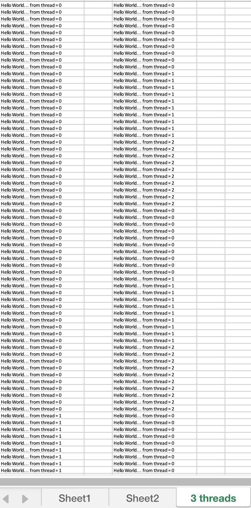
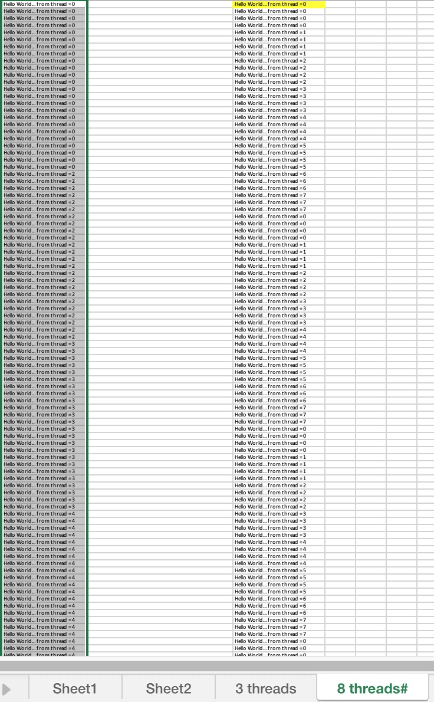
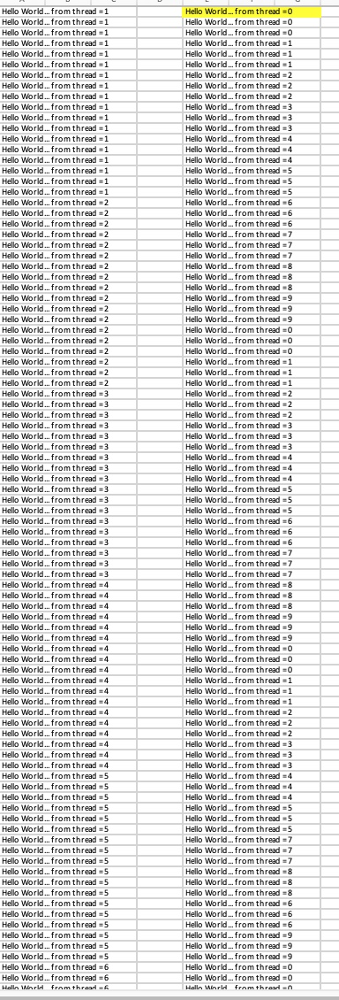

# Assignment 1 Report
Group: 104

Assignment1:

For this assignment, we analyzed the performance of the vector triad benchmark, by performing several tests on a Rome2 architurecture. Parameters such as size of vectors, number of threads and thread allocation were modified to identify their effect over performance. The tested formula is as follows:

`a[i] = b[i]+ c[i] * d[i]`

**GENERAL QUESTIONS**

**A)**  Two variables, **N** and **REP** are retrieved from user input (and tested to see if they fall within the specified range). The former determines the size of the vector and the latter number of repetions for the vector triad multiplication. Taking a look at line 116: 

`while (datasetSize <= N && cycles > 1)`

the predefined variables **datasetSize(=32)** and **cycles(=10**) are being compared with the introduced arguments _in the first iteration_ of this loop. Now here, N has also another interpretation, namely an upper bound for the vector size, and for each vector size we must guarantee at least one round of execution for computing vector a. 

    `   cycles = REP / datasetSize;

        time_a = triad(datasetSize, cycles, &threads);
        m_flop = 2.0 * (double)datasetSize * (double)cycles * 1.0e-6;
        performance_a = m_flop / time_a;

        printf("| %12ld | %12d | %12.2f | %12ld |\n", datasetSize, threads, performance_a, cycles);

        datasetSize *= 2; //increase the size to 64, 128, 256, 1024, 2048, 4096....
    `

Once we enter the loop, **cycles**  is redefined as the ratio between the number of repetitions and datasetSize, to guarantee that we execute N computations at each vector length, which allows us to compare performance across sizes.

While accessing the while loop (caller), we are calling the function **“triad”** (the callee):

`double triad (const long N, const long REP, int *numThreads)`

It’s in this function where the vectors a,b,c,d are constructed, with size N and number of iterations REP. With each iteration from the above loop, we are modifying the variables **datasetSize and cycles**, doubling the value of datasetSize until we reached the upper limit N(introduced by user), and recomputing the ratio cycles, only to be then passed as arguments to the callee function, meaning that with each call the vector size and number or iterations are being changed. 

One can observe that in the formula (from triad()):
a[j] = b[j] + c[j] * d[j] 
There are two arithmetic operations (one multiplication	and one addition). Moreover, this instruction is executed inside a nested loop: the inner loop runs N times, and the outer is executed REP times. Therefore the total number of floating point operations (2) are performed N*REP times. Recall that triad is being called with parameters datasetSize and cycles, so N and REP have these values assigned, hence the number of floating point operations computed into the loop , denoted by m_flop is equal to:
2* datasetSize*cycles. Since we are counting per million, we multiply by 1*10^-6 to get the result in millions of operations. 

**B)** As mentioned above, triad takes as parameters two const long datatypes, N and REP, as well as a pointer to an integer which stores the address of the number of threads. 
N = Determines the size of the vectors
REP = how many times to recompute vector A.

Triad completes by returning a variable of type double named time_spent, indicating how much time was spent on the _. computation of vector A for each of the vector lenghts N a certain number of times REP ._ 

**C)** We use `#pragma omp parallel` to create a parallel region where threads can be spanned. At line 36, each thread repeatedly assigns to the **numThreads** pointer the number of threads so that it can be stored in the integer variable **threads**. However, this step can also be performed without parallelism by removing the pragma, since we only require to assign the variable **threads** once. 

**D)** aligned_loc() is a function introduced by the new C11 standard. It allows to allocate memory spaces with given alignments greater than those admitted by malloc. This function has the following structure: 

`void *aligned_alloc(size_t __alignment, size_t __size)`

 
The requirements to use it are:
-  the size (second argument) requested must be an integral multiple of the alignment (first argument) and 
-  the value of alignment should be a valid alignment supported by the implementation.

 Failure to meet either of them results in undefined behaviour.

In the code, the space allocated for each vector is computed as 

`N*sizeof(double)`. 

Since the minimum value that N can take is 32 (the first iteration of the while loop on line 116 starts with datasetSize set to 32, which is passed as an argument to triad), and sizeof(double), a constant factor, equals 8 bytes. This results in spaces of size 256x bytes (x is an integer factor, as we keep doubling N with each while-loop iteration as mentioned above).

Because of the first condition, 4096 must be an integral multiple of the assigned size, which requires that the variable N to be bigger than 256 (and a power of 2). The idea is to have allocations that are page-size aligned, and this only works when the allocation size is larger than 4096. 

For sizes <=256, there are two options: readjust the alignment or replace `aligned_alloc` with `malloc` for memory allocation with smaller alignments. 

**E)** As discussed in the lecture, when we are trying to optimise for NUMA architecture it is better to parallelise the initialisation of the vectors in the same way that they are later accessed, meaning that the vectors are distributed across locality domains with the first-touch allocation policy. By doing it this way, we reduce the latency and improve the performance regarding memory fetching operations. The static scheduler is used to guarantee that the working load is distributed uniformly across threads on a round-robin fashion, helping to maximise the memory locality, while also offering a deterministic behaviour. 

**F)** This code section runs several iterations of the loop that is wrapped between the time measurement points. This serves as a warmup, because by running this loop before we proceed with the time evaluation, we can reduce the negative effects of cache misses and overheads from setting up the pipelines. By doing so, the obtained results are a more accurate reflection of our object of study, which in this case is the memory bandwidth.  

**G)** When using a parallel region, OpenMP automatically wait for all threads to finish before execution continues (implicit barrier). Furthermore, there is also a synchronization point after each “omp for” loop, implying that threads need to wait until each of them has finished their respective tasks. Since there are no dependencies in the loop, or potential data races, synchronization is not needed after the loop, hence we disable this by using nowait, which also reduces the idle time for each thread and increase performance, thus our results wont' include any synchronization effect and offer a better picture of the ongoing process. 

On another note, the parallel region in line 65: 

` #pragma omp parallel
 {
    for (long i=0; i<REP; i++)
 #pragma omp for schedule(static) nowait
        for (long j=0; j<N; j++)
            a[j] = b[j]+c[j]*d[j];
 }
`
spans several threads (**threads**) across this block thanks to `#pragma omp parallel`. At the first for-loop we only indicate how many times to repeat the subsequent loop, so no parallelising is done here. Therefore, the only thing remaining to do is to distribute the workload from the 2nd for-loop across the existing threads. Noticing that the parallel region is created outside the loop that calculates vector a. If instead we create the parallel region inside the REP loop with `#pragma omp parallel for `, the **nowait** clause isn't compatible with the compiler, so that increases the time_spent and hence performance has smaller values. Another ffactor to consider is the job allocation across threads. We tested a small version of this region to observe how the workload was distributed. 

´

     // Beginning of parallel region 
    #pragma omp parallel 
    
    for (int j=0; j<6; j++)
    #pragma omp for schedule(static) nowait
        for(int i=0; i<30; i++)
            printf("Hello World... from thread = %d\n", 
               omp_get_thread_num());  
    // Ending of parallel region 
} 

´

`

    int main(int argc, char* argv[]) 
{ 
  
  
    
    for (int j=0; j<6; j++)
    #pragma omp parallel for schedule(static) //nowait
        for(int i=0; i<30; i++)
            printf("Hello World... from thread = %d\n", 
               omp_get_thread_num());  
    // Ending of parallel region 
} 

`
The results show (see images below), that when creating a parallel region outside the loop, big chunks are allocated to threads(the default scheduler is static), compared to using `pragma omp parallel for `, where the chunks are smaller and switching between threads causes more overhead. One strategy would be to try to set the chunk sizes before hand to avoid unnecessary thread calls 

**H)** The checksum function could also be useful to compare floating point precision across different systems. One could decrease the tolerance defined (in this case is 0.1), and test which architectures are more suitable for computations that require accurate results. 

**2. EXPERIMENTS AND MEASUREMENTS**

**A)**

**B)**

**C)**

**D)**

**E)**

**F)**

**G)**

**H)**