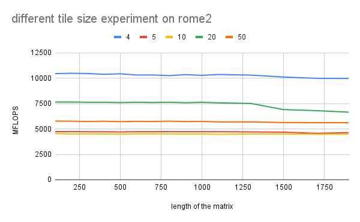
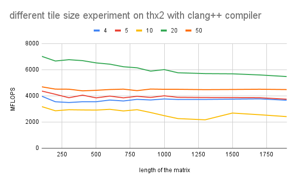

# Assignment 2 Report
Group: TODO

# 1a)

#### Can we safely permute the loops?
Yes, the correctness of our results isn't affected if we change the order of the loops. for small matrices. For big matrices the performance of the implementation is different, because cache
misses are getting dominant for some of the implementations. The fastest implementation is kij, we iterate along
row of A and row of C (least cache misses). The slowest implementation is jki, we iterate along a column of A
(to which we write and read) and a column of C. The implementation ijk is in between, we iterate along a row of
B and column of C, while we write to the same location of A.

#### Explain which of the loops (i, j, k) is parallelizable?
It's possible to parallelize whichever of the outer loops (i or j), since they don't have data dependencies and two
distinct threads will not write to the same memory location. However, with the loops properly nested, outer loop parallelization (i) is usually better, since parallelizing the middle loop (j) increases the overhead and this severely affects the performance. 

When trying to paralleize the third loop (k), data races might occur.
To avoid this, atomic operations are necessary or a `#pragma omp parallel for reduction`.

# 1b)

#### Explain alternative parallelization schemes:

##### - Nested 
OpenMP uses a fork-join model of parallel execution. When a thread encounters a parallel construct, the thread creates a team composed of itself and some additional (possibly zero) number of threads (slave). The encountering thread becomes the master of the new team. When all team members have arrived at the barrier, the threads can leave the barrier. The master thread continues execution of user code beyond the end of the parallel construct, while the slave threads wait to be summoned to join other teams.

OpenMP parallel regions can be nested inside each other. If nested parallelism is **disabled**, then the new team created by a thread encountering a parallel construct inside a parallel region consists only of the encountering thread. If nested parallelism is **enabled**, then the new team may consist of more than one thread. Nested parallelism can be enabled or disabled by setting the **OMP_NESTED ** environment variable or calling **omp_set_nested()** function

The OpenMP runtime library maintains a pool of threads that can be used as slave threads in parallel regions. When a thread encounters a parallel construct and needs to create a team of more than one thread, the thread will check the pool and grab idle threads from the pool, making them slave threads of the team. The master thread might get fewer slave threads than it needs if there is not a sufficient number of the idle threads in the pool. When the team finishes executing the parallel region, the slave threads return to the pool.

##### - pragma omp parallel for collapse(2)
Here the nested looops ij are combined to make a single loop with N*N iterations. Useful to automatically assign iterations to threads

     #pragma omp parallel for collapse(2) schedule(...)
   
      for (i=0; i< N; i++) 
   
        for (j=0; j< N; j++) 
`

###### - Using pragma omp parallel for on each loop

If '#pragma omp parallel for' is used in only one loop, then only its iterations will be distributed along the threads, as seen in the example below, where only j is distributed across the threads (thread 0 gets i = 0, thread 1 gets i = 1...), and the same goes to i when the parallel for clause precedes it: 

By enabling worksharing in loops i and j, nested parallelism is disabled by default on OpenMP, and the second pragma is ignored at runtime: a thread enters the _inner parallel region_, a team of only one thread is created, and each inner loop is processed by a team of one thread. The end result will look, in essence, identical to what we would get without the second pragma — but there is just more overhead in the inner loop:
` 
    
        #pragma omp parallel for
        for (int i = 0; i < 3; ++i) {
            #pragma omp parallel for
            for (int j = 0; j < 6; ++j) {
                c(i, j);
            }
        }
 
On the other hand, if we tried to enable “nested parallelism”, things would get much worse. The inner parallel region would create more threads, and overall we would have more threads competing for the resources of limited CPU cores — not what we want in a performance-critical application. 

When it comes to the scheduling, with for loops where each iteration takes roughly equal time, static schedules work best, as they have little overhead. On the other hand, dynamic scheduling is better when the iterations may take very different amounts of time. However, there is some overhead to dynamic scheduling. Thus, the choice of scheduler will definitely have an impact on the performance according to which kind of loops we are working with.

for balanced loops (where the matrices are squared), a static scheduler is more suitable compared to a dynamic scheduler, with the additional benefit that the scheduling is done at compile time, reducing work at runtime. With the latter, we have high variable work distribution and this can affect the performance, but this is not always the case.

# 2a)
Template_task_a.cpp calculates matrix multiplications and returns MFLOPS regarding different matrix size and number of repetitions. It verifies the results by setting tolerance for the error. 
The plot below compares performances with different flags. The result with flag -O3 shows the worst performance, and the others have almost the same performance. 
The plot below is the comparison of performance on different machines. 

# 2b)
### A[i,j] += B[i,k] * C[k,j]

##### - Ijk calculate all dot product terms of one element, move to an element in the next column, and repeat this row by row
##### - Ikj calculate one term of dot product, and move to the next column of the C. Repeat it for all rows of C and sum up all dot product terms. Do the same for all rows.
##### - Jki calculate a dot product term and move to the next column of B. repert it for all columns of A.
##### - Jik calculate all dot product terms of an element, and one row down and in this way, compute all rows of a column first. Do it for all columns.
##### - Kij calculate a dot product term of an element for all columns and rows. Go over all columns in a row first and repeat for all rows. Do this for all dot product terms.
##### - Kij same principle as kij, but go over rows first.

Caches are loaded row by row. Therefore, if we traverse columns first, caches are utilised and it achieves better performance. Regarding matrix B, not to miss cache, k should be in the loop of i loop so that it traverses columns of B first. Similarly, j should be included in the loop of k so that cache for C matrix is not missed. The order ikj satisfies all these conditions, and ikj shows the best performance indeed, as it computed with 10000 MFLOPS at most. kij showed second best performance since it does not miss cache for C matrix. ijk and jik should utilise cache for matrix A, however they show worse performance than kij. This is because L1 cache is used in the case of kij, but it is missed in the other cases and L2 or L3 cache are used. 

# 2c)
Smaller caches are faster, however the size of data which can be allocated is limited. This is the reason that the figures show some layers of performance levels. 

##### - Rome
It stores and loads data from L1 cache for the tile size of 4, thus, it performs better than the other cases. Tile size of 5 and 10 are not fit to the L1 cache, and since they do not fully utilise L2 cache, they resulted in below 5000 MFLOPS. Tile size of 20 and 50 are fit to L2 cache and L3 cache respectively, so that they show worse performance than tile size of 4, however better than the other two cases.

##### - Icelake
Tile size of 4 and 50 utilise cache. Tile size of 4 uses higher level of cache so it performs better than the other. The other three tile sizes are missing caches.

##### - ThunderX2
Tile size of 20 fits to the cache size so that the performance is better than the other cases. Tile size of 10 significantly misses caches.

##### - CS500
Similar layers of performance levels are observed as in the case of ThunderX2. 

# 2d)

# 2e)
We implemented 4 different parallelizations: 

From the results obtained in part 2b), the most optimal loop sequence was IKJ, so we worked with this structure for the first two parallelizing schemes: 

- P1) parallelized the outer loop with `#pragma omp parallel for` using **(static).**
- P2) parallelized the outer loop with `#pragma omp parallel for` using  **(dynamic, 10).**

`   
    
     for( int r=0; r<REP; ++r ) {

     //#pragma omp parallel for schedule(dynamic, 10)
     #pragma omp parallel for schedule(static)  
     for( int i=0; i<N; i++ ) {
     
      for( int k=0; k<N; k++ ) {
     
        for( int j=0; j<N; j++ ) {     
     
          a[TWO_D_ACCESS(i, j, N)] += b[TWO_D_ACCESS(i, k, N)] * c[TWO_D_ACCESS(k, j, N)];
        }
      }
     }
    }

`
The other two modalities were optimized with the original loop sequence IJK:

- P3) Using `#pragma omp parallel for collapse (2)`, using **(static).**
- P4) Using `#pragma omp parallel for collapse (2)`, using **(dynamic, 10).**

`
    
     
     for( int r=0; r<REP; ++r ) 
     {
      //#pragma omp parallel for schedule(dynamic, 10)
      #pragma omp parallel for schedule(static)  
      for( int i=0; i<N; i++ ) 
      {     
       for( int k=0; k<N; k++ ) 
        {     
        for( int j=0; j<N; j++ ) 
         {     
               a[TWO_D_ACCESS(i, j, N)] += b[TWO_D_ACCESS(i, k, N)] * c[TWO_D_ACCESS(k, j, N)];
         }
        }
      }
     }

`

10 was defined as the chunk size since it is a common divisor for the matrix sizes that weree tested: N= 100, 1900.

We tested our parallel implementations on each of the architectures with the four cases requested. The following table summarizes the principal information from our strong scaling experiments:

| **architecture**  | **rome2**   | **icelake** |**thunderx2** | **AMDA64fX** | 
| ------            | ------      | -------     |---------     | --------     | 
|cores(threads/core)| 128(x2)     | 72(x2)      | 64(x4)       |   48         |
|                   |             |             |              |              | 
|threads_tested     | 1,2,4,8,16, |1,2,4,8,16,  | 1,2,4,8,16   | 1,2,4,6,12,  |
|                   |32,48,64,128,| 32,48,64,96,| 32,64,128,   |   24,48,96.  |
|                   | 256,512     | 144,256     |  256, 512.   |              |

For our speedup calculations, we used a very straightforward definition (Xin Li, 2018):

          speedup = t_1 / t_p 

where t1 is the computational time for running the code using one thread, and t_p is the computational time running the same software with p threads. I

In the function mm, **MFLOPS** (named mf in main) is defined as the ratio of **mflop**(calculated as 2*N*N*N*REP*10^-6) and **dur** (time spent running the matrix multiplication). Solving for **dur** we have:

   
    mf = mflop/dur
    dur = mflop/mf

    setting dur = t for the speedup formula:

    speedup = dur_1 / dur_p = (mflop/mf_1)/(mflop/mf_p) = mf_p / mf_1  for same N and REP

Hence, we simply divide the MFLOPS obtained with a certain number of threads over the MFLOPS resulting from using one thread only (sequential implementation).

Due to the high number of experiments (20), we organized a comparison file displaying the results on each of the machines mentioned above: [!strong_scaling_experiments](https://docs.google.com/spreadsheets/d/1i4sb7GSJOhfAVOtjGG-Pbo4gteafVWmv8SwQbUq5z-o/edit?usp=sharing), under the tab "comparisons"

- What kind of scaling is visible for all 4 cases? Can you explain why?

- Explain the scaling behavior between N=100 and N=1900, and the difference between the scaling curves of ‘close’ and ‘spread’ bindings.

(e) ParallelizeyourcodevariantsusingOpenMP.Testyourparallelversionsonallplatforms with different numbers of cores as given in assignment 1. Run strong scaling experi- ments and create speedup figures (i.e., for all measurements for one curve, use exactly the same workload = same repetition count): core count on X axis, achieved speedup vs. sequential run on Y axis - i.e., point (1/1) always starts the curve.
Consider the following 4 cases for scaling experiments:
• Case 1: N=100, binding=close
• Case 2: N=100, binding=spread • Case 3: N=1900, binding=close
• Case 4: N=1900, binding=spread
What kind of scaling is visible for all 4 cases? Can you explain why? Specifically, explain the scaling behavior between N=100 and N=1900, and the difference between the scaling curves of ‘close’ and ‘spread’ bindings.

