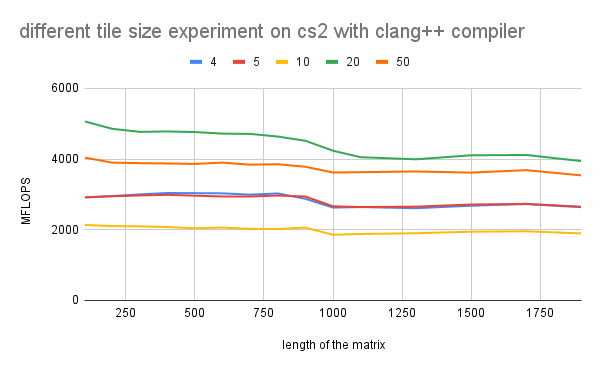

# Assignment 2 Report
Group: 104

# 1a)

#### Can we safely permute the loops?
Yes, the correctness of our results isn't affected if we change the order of the loops. However, for big matrices the performance of the implementation is different, because cache misses are getting dominant for some of the implementations.

#### Explain which of the loops (i, j, k) is parallelizable?
It's possible to parallelize whichever of the outer loops (i or j), since they don't have data dependencies and two
distinct threads will not write to the same memory location. However, with the loops properly nested, outer loop parallelization (i) is usually better, since parallelizing the middle loop (j) increases the overhead and this severely affects the performance. 

When trying to paralleize the third loop (k), data races might occur.
To avoid this, atomic operations are necessary or a `#pragma omp parallel for reduction` with an auxiliary variable that will write to the assigned memory location.

# 1b)

#### Explain alternative parallelization schemes:

##### - Nested 
OpenMP uses a fork-join model of parallel execution. When a thread encounters a parallel construct, the thread creates a team composed of itself and some additional (possibly zero) number of threads (slave). The encountering thread becomes the master of the new team. When all team members have arrived at the barrier, the threads can leave the barrier. The master thread continues execution of user code beyond the end of the parallel construct, while the slave threads wait to be summoned to join other teams.

OpenMP parallel regions can be nested inside each other. If nested parallelism is **disabled**, then the new team created by a thread encountering a parallel construct inside a parallel region consists only of the encountering thread. If nested parallelism is **enabled**, then the new team may consist of more than one thread. Nested parallelism can be enabled or disabled by setting the **OMP_NESTED ** environment variable or calling **omp_set_nested()** function

The OpenMP runtime library maintains a pool of threads that can be used as slave threads in parallel regions. When a thread encounters a parallel construct and needs to create a team of more than one thread, the thread will check the pool and grab idle threads from the pool, making them slave threads of the team. The master thread might get fewer slave threads than it needs if there is not a sufficient number of the idle threads in the pool. When the team finishes executing the parallel region, the slave threads return to the pool.

##### - pragma omp parallel for collapse(2)
Here the nested looops ij are combined to make a single loop with N*N iterations. Useful to automatically assign iterations to threads

     #pragma omp parallel for collapse(2) schedule(...)
   
      for (i=0; i< N; i++) 
   
        for (j=0; j< N; j++) 
`

###### - Using pragma omp parallel for on each loop

If '#pragma omp parallel for' is used in only one loop, then only its iterations will be distributed along the threads, as seen in the example below, where only j is distributed across the threads (thread 0 gets i = 0, thread 1 gets i = 1...), and the same goes to i when the parallel for clause precedes it: 

By enabling worksharing in loops i and j, nested parallelism is disabled by default on OpenMP, and the second pragma is ignored at runtime: a thread enters the _inner parallel region_, a team of only one thread is created, and each inner loop is processed by a team of one thread. The end result will look, in essence, identical to what we would get without the second pragma — but there is just more overhead in the inner loop:
` 
    
        #pragma omp parallel for
        for (int i = 0; i < 3; ++i) {
            #pragma omp parallel for
            for (int j = 0; j < 6; ++j) {
                c(i, j);
            }
        }
 
On the other hand, if we tried to enable “nested parallelism”, things would get much worse. The inner parallel region would create more threads, and overall we would have more threads competing for the resources of limited CPU cores — not what we want in a performance-critical application. 

When it comes to the scheduling, with for loops where each iteration takes roughly equal time, static schedules work best, as they have little overhead, with the additional benefit that the scheduling is done at compile time. On the other hand, dynamic scheduling is better when the iterations may take very different amounts of time. However, there is some overhead to dynamic scheduling. Thus, the choice of scheduler will definitely have an impact on the performance according to which kind of loops we are working with. 

# 2a)
Template_task_a.cpp calculates matrix multiplications and returns MFLOPS regarding different matrix size and number of repetitions. It verifies the results by setting tolerance for the error. 
The plot below compares performances with different flags. 
Each flag has meanings as below:
##### -O3
-O3 is an optimization flag which turns on all optimization of -O2 and some optimizations more.
##### -Ofast
-Ofast disregards strict standards compliance. It turns on all -O3 optimizations. It also enables optimizations that are not valid for all standard-compliant programs.
##### -march=native
-march=native selects the CPU to generate code for at compilation time by determining the processor type of the compiling machine. Using -march=native enables all instruction subsets supported by the local machine.
##### -Os
-Os optimises for size. It enables all -O2 optimizations except those that often increase code size.

As seen in the figure, -Ofast shows the best performance out of all flags tested. This is because it turns off strict standards compliance and enables more optimization in addition to -O3. However, it also implies that it is error prone. Indeed, it shows unstable behaviour in the small matrix size region. Therefore, It can not be regarded as the best option.
The combination of -march=native and -Ofast is the second best. Additionally it does not show unstable behaviour like the -Ofast case. From the comparison between no flag case and -march=native case, -march=native does not influence the performance improvement. Rather it can make performance worse, which can be observed from the comparison of -O3 and the combination of -O3, -march=native.

The plot below is the comparison of performance on different machines. Icelake machine shows ups and downs of MFLOPS depending on the matrix size. MFLOPS are dependent on the number of cores except the case of Intel Icelake, since it shows better performance than AMD Rome. This is due to the hyper-threading which enables more threads to run on a single core. 

# 2b)
##### A[i,j] += B[i,k] * C[k,j]

##### - Ijk 
calculate all dot product terms of one element, move to an element in the next column, and repeat this row by row
##### - Ikj 
calculate one term of dot product, and move to the next column of the C. Repeat it for all rows of C and sum up all dot product terms. Do the same for all rows.
##### - Jki 
calculate a dot product term and move to the next column of B. repert it for all columns of A.
##### - Jik 
calculate all dot product terms of an element, and one row down and in this way, compute all rows of a column first. Do it for all columns.
##### - Kij 
calculate a dot product term of an element for all columns and rows. Go over all columns in a row first and repeat for all rows. Do this for all dot product terms.
##### - Kij 
same principle as kij, but go over rows first.

Caches are loaded row by row. Therefore, if we traverse columns first, caches are utilised and it achieves better performance. Regarding matrix B, not to miss cache, k should be in the loop of i loop so that it traverses columns of B first. Similarly, j should be included in the loop of k so that cache for C matrix is not missed. The order ikj satisfies all these conditions, and ikj shows the best performance indeed, as it computed with 10000 MFLOPS at most. kij showed second best performance since it does not miss cache for C matrix. ijk and jik should utilise cache for matrix A, however they show worse performance than kij. This is because L1 cache is used in the case of kij, but it is missed in the other cases and L2 or L3 cache are used. 

# 2c)
Smaller caches are faster, however the size of data which can be allocated is limited. This is the reason that the figures show some layers of performance levels. 

##### - AMD Rome
It stores and loads data from L1 cache for the tile size of 4, thus, it performs better than the other cases. Tile size of 5 and 10 are not fit to the L1 cache, and since they do not fully utilise L2 cache, they resulted in below 5000 MFLOPS. Tile size of 20 and 50 are fit to L2 cache and L3 cache respectively, so that they show worse performance than tile size of 4, however better than the other two cases.

##### - Intel Icelake
Tile size of 4 and 50 utilise cache. Tile size of 4 uses higher level of cache so it performs better than the other. The other three tile sizes are missing caches.

##### - ThunderX2
Tile size of 20 fits to the cache size so that the performance is better than the other cases. Tile size of 10 significantly misses caches.

##### - AMD A64FX
Similar layers of performance levels are observed as in the case of ThunderX2. 

# 2d)
##### AMD Rome: g++ vs clang++
The calculation with clang compiler performs better than gnu compiler over all tile sizes except tile size = 20, which resulted in almost the same. Clang compiler achieved maximum 40000 MFLOPS which is 4 times greater than the best performance of c++ compiler.

##### Intel Icelake: g++ vs icc
All the performances with clang compiler are better than gnu compiler. The performance with tile size of 20 shows exceptionally good as it shows two times more MFLOPS than the others. However, all the other tile sizes are nearly the same performance, that implies only the case with tile size of 20 does not miss caches.

##### ThunderX2: g++ vs clang++
No significant difference is observed between the performances with gnu compiler and clang compiler.

##### AMD A64FX: g++ vs clang++
Same as ThunderX2, no significant difference is observed between the performances with gnu compiler and clang compiler.

#### Vector instructions
Vector instructions are observed:
- AMD Rome (g++, clang++)
- Intel Icelake (g++, icc)

not observed:
- ThunderX2 (g++, clang++)
- A64FX (g++, clang++)

# 2e)
We implemented 4 different parallelizations: 

From the results obtained in part 2b), the most optimal loop sequence was IKJ, so we worked with this structure for the first two parallelizing schemes: 

- P1) parallelized the outer loop with `#pragma omp parallel for` using **(static).**
- P2) parallelized the outer loop with `#pragma omp parallel for` using  **(dynamic, 10).**

`   
    
     for( int r=0; r < REP; ++r ) {

     //#pragma omp parallel for schedule(dynamic, 10)
     #pragma omp parallel for schedule(static)  
     for( int i=0; i< N; i++ ) {
     
      for( int k=0; k< N; k++ ) {
     
        for( int j=0; j<N; j++ ) {     
     
          a[TWO_D_ACCESS(i, j, N)] += b[TWO_D_ACCESS(i, k, N)] * c[TWO_D_ACCESS(k, j, N)];
        }
      }
     }
    }

`
The other two modalities were optimized with the original loop sequence IJK:

- P3) Using `#pragma omp parallel for collapse (2)`, using **(static).**
- P4) Using `#pragma omp parallel for collapse (2)`, using **(dynamic, 10).**

`
    
     
     for( int r=0; r < REP; ++r ) 
     {
      //#pragma omp parallel for schedule(dynamic, 10)
      #pragma omp parallel for schedule(static)  
      for( int i=0; i < N; i ++ ) 
      {     
       for( int k=0; k < N; k++ ) 
        {     
        for( int j=0; j < N; j++ ) 
         {     
               a[TWO_D_ACCESS(i, j, N)] += b[TWO_D_ACCESS(i, k, N)] * c[TWO_D_ACCESS(k, j, N)];
         }
        }
      }
     }

`

10 was defined as the chunk size since it is a common divisor for the matrix sizes that weree tested: N= 100, 1900.

We tested our parallel implementations on each of the architectures with the four cases requested. The following table summarizes the principal information from our strong scaling experiments:

| **architecture**  | **rome2**   | **icelake** |**thunderx2** | **AMDA64fX** | 
| ------            | ------      | -------     |---------     | --------     | 
|cores(threads/core)| 128(x2)     | 72(x2)      | 64(x4)       |   48         |
|                   |             |             |              |              | 
|threads_tested     | 1,2,4,8,16, |1,2,4,8,16,  | 1,2,4,8,16   | 1,2,4,6,12,  |
|                   |32,48,64,128,| 32,48,64,96,| 32,64,128,   |   24,48,96.  |
|                   | 256,512     | 144,256     |  256, 512.   |              |

For our speedup calculations, we used a very straightforward definition (Xin Li, 2018):

          speedup = t_1 / t_p 

where t1 is the computational time for running the code using one thread, and t_p is the computational time running the same software with p threads. I

In the function mm, **MFLOPS** (named mf in main) is defined as the ratio of **mflop**(calculated as 2*N*N*N*REP*10^-6) and **dur** (time spent running the matrix multiplication). Solving for **dur** we have:

   
    mf = mflop/dur
    dur = mflop/mf

    setting dur = t for the speedup formula:

    speedup = dur_1 / dur_p = (mflop/mf_1)/(mflop/mf_p) = mf_p / mf_1  for same N and REP

Hence, we simply divide the MFLOPS obtained with a certain number of threads over the MFLOPS resulting from using one thread only (sequential implementation).

Due to the high number of experiments (20), we organized a comparison file displaying the results on each of the machines mentioned above: [!strong_scaling_experiments](https://docs.google.com/spreadsheets/d/1i4sb7GSJOhfAVOtjGG-Pbo4gteafVWmv8SwQbUq5z-o/edit?usp=sharing), under the tab "comparisons"

- What kind of scaling is visible for all 4 cases? Can you explain why?

Strong scaling concerns the speedup for a **fixed problem size** with respect to the number of processors. For this task, the setup was to use same problem size at each case(100 or 1900), while increasing the number of threads accordingly to the number of cores existing on each architecture. A parallel algorithm has perfect strong scaling if its running time on P processors is linear in 1/P, in other words, using p processors should achieve a speedup of p. However this is not the case, as seen on each of the 20 plots. This can be explained by Amdahl's law, who pointed out that the speedup is limited by the fraction of the serial part of the program that is not amenable to parallelization [Xin Li, 2018]. On each of the implementations provided, we weren't able to optimize the whole multiplication, except for one or two loops, whereas the inner loop remained sequential to guarantee correct results in our computations.

- Explain the scaling behavior between N=100 and N=1900, and the difference between the scaling curves of ‘close’ and ‘spread’ bindings.

Threads were assigned to cores via OMP_PLACES=cores. For N=100, 3200 REPS were perfomed, vs 1 for N=1900

 

Some aspects to consider are cache locality and memory bandwidth. With a close binding, the former is improved, whereas for the latter, a spread binding is necessary (LUMI, see references). 

# 2f) 
Using lscpu on the terminal and the information provided from lecture 1, we gathered the following elements for each architecture as seen on the table below. For the FLOPS calculation, we simply multiplied the fused multiply-add(FMA) for 2 (this is how vendors also express their results when asked about peak performance, see references), which is the number of arithmetic operations performed in this computation and extend the assumption that the FMA throughput is 1 per cycle to our accounted FLOPS (i.e, 2 FLOPS/cycle). 

The formula for calculating the theoretical peak performance that we used is:
PP = CPU_clockspeed * CPU_cores * CPU instructions per cycle * number of vector units.

For our calculations, we took the maximum number of threads (hardware and virtual) as the CPU_cores defined on each architecture. This is merely the number of cores multiplied by the number of threads per core. 
The values selected for comparison against the theoretical peak performance are the maximum results selected across all parallelization schemes, with the highest number of threads specific to each architecture (i.e, for Rome2 we chose the maximum value of MFLOPS along the experiments with num_threads = 256, for Icelake 144…).

The results show that there is still room for improvement regarding our parallel implementations. However, assessing our outcomes with respect to this frame isn’t an honest evaluation of the proposed solutions, given that achieving this performance is realistically difficult. One should consider other metrics to evaluate how optimal a program is. Furthermore, a thorough analysis of the presented task (matrix multiplication), shows that for big sizes N, this problem tends to be memory bound, so a more meaningful and fairer analysis would be to compare how memory is exploited in our implementation for augmenting N. 

# 2g) 
Very big matrix sizes cannot be cached because we keep using new elements during matrix multiplication. For this task we used the following specifications which gave the highest performance on the AMD Rome architecture.
**Loop=ikj, Threads=128, N=4000, Binding=close, schedule=static**
With this code variant we get a performance of **38881.382 MFLOPS**. Considering fused addition multiplication to be one operation with 3 vectors of size 4000 each. The total number of mega floating point operations is calculated as:

**1 * 4000 * 4000 * 4000 * 0.000001 = 64000 MFLOP**

Using this we can calculate the time taken for the calculation to be 1.646032026 seconds. 
The Estimated Megabytes transferred with N=4000 is 

8[bytes/element] * (4000*4000*4000)[elements] * 10^-6 = 1536000 MegaBytes

Using these two numbers for time and bytes we get the bandwidth calculation to be

1536000 MegaBytes/1.646032026 seconds = **933153.168 MB/sec**

However, when looking at the multiplication itself we notice that with any loop variant, while the innermost loop is being iterated through, one of three  matrices  does not change its entry. For example with the ikj loop and the given code below, we notice that for the innermost j-loop the entries of the variables a and c change on each iteration while variable **b** only changes when the k-loop iterates. 

This is important because it means that the cache is in fact being utilized for large parts of the calculations each time because looking at the example above the element of variable **b** stays within the cache each whole iteration of the innermost j-loop. This makes it difficult to estimate the main memory bandwidth utilization because not every array element is being retrieved from the main memory each time, some remain in cache. This is different to the vectorTriad case in assignment 1, where with big data-sizes it was guaranteed that each array element would be retrieved from the main memory at each iteration of every loop.

To avoid this some sort of padding can be implemented so that the (b) element in the case above is first copied to another array. All b elements would be copied to an array 4000X4000 long for the specific case above. Then, even though there will be sets of 4000 values which will correspond to each element of (b) since they will be accessed the same way as the elements of (a) and (c) this will ensure that all data is retrieved from main memory and not cache.

# 2h) 
From the question above we have already obtained the peak computational performance for the specifications stated in question 2g, which is **38881.382 MFLOPS** and the estimated bandwidth which is **933153.168 MB/sec**. What is remaining to be found is the reading computational intensity which is how fast memory is retrieved from the main memory, not accounting the time to write to main memory. Since we have 2 operations, addition and multiplication and we are using three doubles each of size 8 byte, the computational intensity is **2/24 Flop/byte**. 

Similarly for assignment 1, we will use the following specification to construct the roofline model which gave the highest performance. These are obtained from question 2e for the AMD ROME system.

**N=2^26,Threads=256, Binding=spread, Triad algorithm**

The peak performance is **16838 MFLOPS**, and the bandwidth is **269408 MB/sec**. The computational intensity is again **2/24 Flop/byte** because we have again an addition and a multiplication and three variables which are read from memory each time.

Note: A correction was made for the bandwidth calculation by using the factor 16 instead of 2 for the multiplication.

With these numbers we multiply computational intensity and memory bandwidth in order to get the memory retrieval performance. For the matrix multiplication system it is:

**933153.168 [MB/sec] * 2/24 [Flop/byte] = 77762.764 [MFlops] >  38881.382 [MFlops]**

For the triad calculations the value is:

**269408  [MB/sec] *  2/24 [Flop/byte] = 22450.667 [MFlops] > 16838 [MFlops]**

We notice that for both assignments the memory performance is greater than cpu performance. This basically means that the computer is limited by how fast its cpu can perform operations rather than how fast data is being retrieved from the main memory. This is reflected in the roofline models drawn below.

# 2i) 
The following techniques can be used to further optimize matrix multiplication calculation

1. Use an optimized matrix multiplication algorithm example Divide-and-conquer algorithm or the Strassen algorithm
2. Use SIMD intrinsics i.e hardware-level data parallelism to improve performance.
3. Memory prefetch: A lot of cache misses are intrinsic misses, during which the L1, L2 caches are being loaded with data from the memory. Pre-fetch can help reduce these latencies. Usually compilers do not support these techniques and hence these operations have to be done in assembly level code, which makes it difficult to implement them.

According to the lrz website the SuperMUC-NG has 6,480 nodes in total. Comparisons will be made against systems in the top 500 list for which number of nodes have been listed. The Maximal LINPACK performance achieved with HPL is marked by the number Rmax on the website. 

The 2nd Ranked system Summit has 4,356 nodes and the ratio of HPL (Rmax) to peak  (Rpeak)performance is 148,600.0/200,794.9 = **0.740**
The 3rd Ranked system Sierra has  4,320 nodes and the ratio of HPL(Rmax) to peak (Rpeak) performance is 94,640.0/125,712.0 = **0.753**
The 5th Ranked system Perlmutter has  1536 nodes and the ratio of HPL(Rmax) to peak (Rpeak) performance is 70,870.0/93,750.0 = **0.756**

