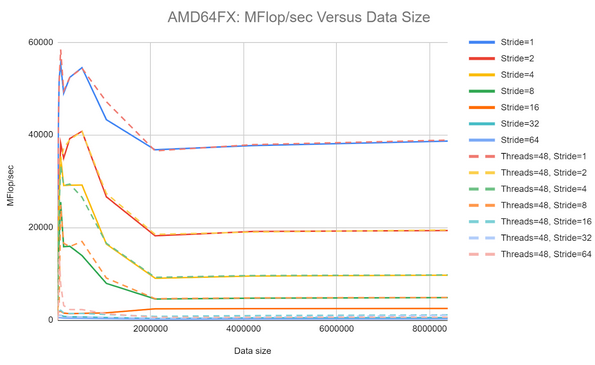

# Assignment 3 Report
Group: 104

#1a) 
In this part after copying the triad code changes were made according to the question. Firstly, the variable N was redefined to mean the “number of triad computations done over the arrays” as required by the worksheet itself. Since in the worksheet it is stated that “each array now needs to have N * STRIDE elements” i.e N*STRIDE=datasetSize, N is defined as
N= datasetSize/stride. The places in the triad code where the variable N was used in worksheet 1 is changed to datasetSize for this worksheet.
The iteration loop for (j) is changed to  (long j=0; j< N*STRIDE; j+=STRIDE) according to the worksheet requirement. For the j-loop which initializes the arrays’ elements, all elements were still initialized to certain values to avoid using dummy data anywhere. The function calculateMegaFlopRate(N, repetitions, time_spent) gets the parameter N and the output from this function is calculated as follows:

The above code first calculates the MFLOP as 2 operations multiplied with the number of elements that were part of the computation (N) and then scaled to mean mega flops. The output is the MFLOP/sec.

Next, since the variable (threads) was set equal to omp_get_max_threads() to use all hardware threads automatically for each machine. The point to threads inside the original triad code was  removed but threads was left as part of the argument to triad so as not to overcomplicate and make unneeded changes to the original code.

Finally, STRIDE was added as an additional argument that the user gives. The code for this was edited in the main function and the test script file accordingly.

#1b) 
Firstly to pin the threads to their cores the following script was used:

OMP_NUM_PLACES=threads ./assignment3_part_1 33554432 67108864 STRIDE 

The above code pins each thread to its logical core using OMP_NUM_PLACES and uses maximum dataset size=33554432=2^25 and the totalNumberProcessedPoints=67108864=2^26. Instead of the STRIDE here the required number is set. The references for using this code to bind the threads to logical cores are given below:
https://gitlab.lrz.de/beastlab22ss/hints/-/blob/master/pinning/pinning.md
https://hpc-wiki.info/hpc/Binding/Pinning
https://www.openmp.org/spec-html/5.0/openmpse53.html

The curves produced on the 4 different systems in BEAST for various STRIDE sizes are given below

Looking at these graphs, first we need to remember that each thread is bound to a core. This means that even if a thread finishes its computation it has to wait for its processor to retrieve data from the cache or memory and cannot switch over to another processor to continue calculations in the meantime. This reduces the performance. 
For small data sizes the performance across all machines is generally better than most other data sizes because small data sizes usually fit into the caches and there are fewer cache misses. As data size increases cache misses go up and performance goes down. 

For the same data size, larger strides usually cause drop in performance as they cause less data, that is used for computations, to be loaded to the cache at a time. This causes obvious cache misses. However, for some data sizes for each system, we get a dramatic increase in performance. This probably occurs when the stride we are using corresponds well to the number of threads/cores on that machine, when each core retrieves a good number of elements from each array each time to store in the caches, for computations. If this happens, then the performance suddenly goes up for that combination of system in use, the threads it has, the datasetSize and the stride we have set. These values are of course different for each system. This happens because of numa domains, which also have separate memory and I/O channels dedicated to them. When a thread has to access memory outside its numa domain due to a stride or otherwise, it takes longer. For some stride values it could be that the maximum array elements lie in numa domain memory of the thread working on them or in a thread in the same domain. This causes the sudden spike.

For most systems in the graphs above, the sudden jump in the performance value, due to the special combination of parameters mentioned above, does not seem to depend largely on the stride being used, as the peak in the graph remains the same across stride sizes. However, in the IceLake system it is noticed that this combination is largely affected by the stride as we see peaks appear for two very different strides on the same system. For all machines however, the effect of the stride seems to disappear for very large data sizes.

To compare results across machines, a representative line from each machine for Stride=1 is plotted on the graph below.

We notice again that for each line the smallest data set size gets a good performance. However, we also notice that for each system, there is a combination of the threads it has, the data set size, and also the stride size being used for which it gives a performance even better than on small data set sizes. This again is the case seen for threads being binded to logical cores, which probably allows optimal memory retrieval and calculation time across all cores, for some specific datasize, to result in this performance boost. The AMD ROME system seems to allow this for the highest data set size for all strides in comparison to the 4 different systems. In the graph above for stride=1 since the threads are bound to cores, giving each thread a smaller chunk would reduce the time it needs to spend retrieving data from main memory. This makes the whole calculation perform faster in parallel. Thus having more threads is better when the threads are bound to the cores. AMD ROME has the highest performance for the largest data size, because it has 256 cores which is the highest. When we increase stride we just reduce the number of array elements that are computed upon and stored in the cache each time by half. But the performance still remains the highest for that same data size usually unless another stride fits the number of cores and data size better.
However, architecture specific differences also matter since the THUNDER system also has 256 threads, but 4 cores, and yet it has much worse performance than the ROME system. Thus for this experiment having more threads per core appears to be better. This means that more parameters probably need to be analyzed to understand why ROME has the best performance for this experiment. 

#1c)
For this task we set the number of threads equal to the cores for each system as suggested by the teaching instructor Sergej Breiter. We used OpenMP, not setting OMP_PROC_BIND, and only using OMP_PLACES=threads. This way “threads are pinned to logical cores and can not move at all -- they are pinned to a logical core (hw-thread)” as stated from the reference.   (https://gitlab.lrz.de/beastlab22ss/hints/-/blob/master/pinning/pinning.md)

We see from the graphs that the syntax used to assign threads affects performance because we set the number of threads exactly equal to what the function omp_get_max_threads() sets them to. This is probably due to the native compiler optimization differences on all systems. In the comparison graphs we see that the outlier spikes/peaks are still there for all systems. In some cases they are shifted, in some they match almost exactly and in some, and in the case of ice lake the peak for stride=1 even disappears. 

#2a)
#2b)
#2c)
#2d)
#2e)
#2f) 
https://docs.google.com/document/d/1R_ex496kSarxw2wwGjKrnNCNYF1gRq-fGot8CG-biXI/edit?usp=sharing
#2g)
#2h)
