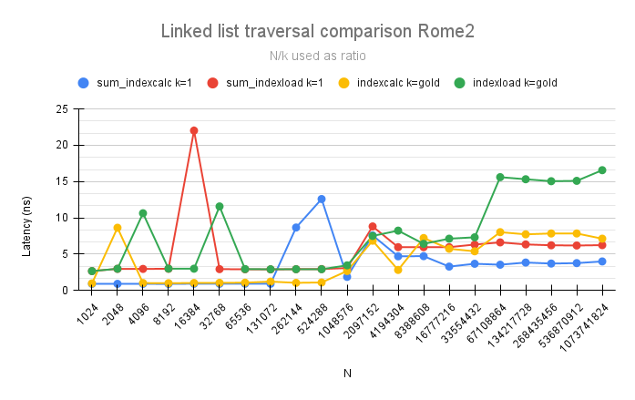
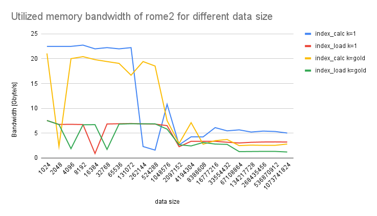

# Assignment 3 Report
Group: 104

#### 1) Cache line utilization
# 1a)
 
In this part after copying the triad code changes were made according to the question. Firstly, the variable N was redefined to mean the “number of triad computations done over the arrays” as required by the worksheet itself. Since in the worksheet it is stated that “each array now needs to have N * STRIDE elements” i.e N*STRIDE=datasetSize, N is defined as
N= datasetSize/stride. The places in the triad code where the variable N was used in worksheet 1 is changed to datasetSize for this worksheet.
The iteration loop for (j) is changed to  (long j=0; j< N*STRIDE; j+=STRIDE) according to the worksheet requirement. For the j-loop which initializes the arrays’ elements, all elements were still initialized to certain values to avoid using dummy data anywhere. The function calculateMegaFlopRate(N, repetitions, time_spent) gets the parameter N and the output from this function is calculated as follows:

The above code first calculates the MFLOP as 2 operations multiplied with the number of elements that were part of the computation (N) and then scaled to mean mega flops. The output is the MFLOP/sec.

Next, since the variable (threads) was set equal to omp_get_max_threads() to use all hardware threads automatically for each machine. The point to threads inside the original triad code was  removed but threads was left as part of the argument to triad so as not to overcomplicate and make unneeded changes to the original code.

Finally, STRIDE was added as an additional argument that the user gives. The code for this was edited in the main function and the test script file accordingly.

# 1b)
 
Firstly to pin the threads to their cores the following script was used:

OMP_NUM_PLACES=threads ./assignment3_part_1 33554432 67108864 STRIDE 

The above code pins each thread to its logical core using OMP_NUM_PLACES and uses maximum dataset size=33554432=2^25 and the totalNumberProcessedPoints=67108864=2^26. Instead of the STRIDE here the required number is set. The references for using this code to bind the threads to logical cores are given below:
https://gitlab.lrz.de/beastlab22ss/hints/-/blob/master/pinning/pinning.md
https://hpc-wiki.info/hpc/Binding/Pinning
https://www.openmp.org/spec-html/5.0/openmpse53.html

The curves produced on the 4 different systems in BEAST for various STRIDE sizes are given below

Looking at these graphs, first we need to remember that each thread is bound to a core. This means that even if a thread finishes its computation it has to wait for its processor to retrieve data from the cache or memory and cannot switch over to another processor to continue calculations in the meantime. This reduces the performance. 
For small data sizes the performance across all machines is generally better than most other data sizes because small data sizes usually fit into the caches and there are fewer cache misses. As data size increases cache misses go up and performance goes down. 

For the same data size, larger strides usually cause drop in performance as they cause less data, that is used for computations, to be loaded to the cache at a time. This causes obvious cache misses. However, for some data sizes for each system, we get a dramatic increase in performance. This probably occurs when the stride we are using corresponds well to the number of threads/cores on that machine, when each core retrieves a good number of elements from each array each time to store in the caches, for computations. If this happens, then the performance suddenly goes up for that combination of system in use, the threads it has, the datasetSize and the stride we have set. These values are of course different for each system. This happens because of numa domains, which also have separate memory and I/O channels dedicated to them. When a thread has to access memory outside its numa domain due to a stride or otherwise, it takes longer. For some stride values it could be that the maximum array elements lie in numa domain memory of the thread working on them or in a thread in the same domain. This causes the sudden spike.

For most systems in the graphs above, the sudden jump in the performance value, due to the special combination of parameters mentioned above, does not seem to depend largely on the stride being used, as the peak in the graph remains the same across stride sizes. However, in the IceLake system it is noticed that this combination is largely affected by the stride as we see peaks appear for two very different strides on the same system. For all machines however, the effect of the stride seems to disappear for very large data sizes.

To compare results across machines, a representative line from each machine for Stride=1 is plotted on the graph below.

We notice again that for each line the smallest data set size gets a good performance. However, we also notice that for each system, there is a combination of the threads it has, the data set size, and also the stride size being used for which it gives a performance even better than on small data set sizes. This again is the case seen for threads being binded to logical cores, which probably allows optimal memory retrieval and calculation time across all cores, for some specific datasize, to result in this performance boost. The AMD ROME system seems to allow this for the highest data set size for all strides in comparison to the 4 different systems. In the graph above for stride=1 since the threads are bound to cores, giving each thread a smaller chunk would reduce the time it needs to spend retrieving data from main memory. This makes the whole calculation perform faster in parallel. Thus having more threads is better when the threads are bound to the cores. AMD ROME has the highest performance for the largest data size, because it has 256 cores which is the highest. When we increase stride we just reduce the number of array elements that are computed upon and stored in the cache each time by half. But the performance still remains the highest for that same data size usually unless another stride fits the number of cores and data size better.
However, architecture specific differences also matter since the THUNDER system also has 256 threads, but 4 cores, and yet it has much worse performance than the ROME system. Thus for this experiment having more threads per core appears to be better. This means that more parameters probably need to be analyzed to understand why ROME has the best performance for this experiment. 

# 1c)

For this task we set the number of threads equal to the cores for each system as suggested by the teaching instructor Sergej Breiter. We used OpenMP, not setting OMP_PROC_BIND, and only using OMP_PLACES=threads. This way “threads are pinned to logical cores and can not move at all -- they are pinned to a logical core (hw-thread)” as stated from the reference.   (https://gitlab.lrz.de/beastlab22ss/hints/-/blob/master/pinning/pinning.md)

We see from the graphs that the syntax used to assign threads affects performance because we set the number of threads exactly equal to what the function omp_get_max_threads() sets them to. This is probably due to the native compiler optimization differences on all systems. In the comparison graphs we see that the outlier spikes/peaks are still there for all systems. In some cases they are shifted, in some they match almost exactly and in some, and in the case of ice lake the peak for stride=1 even disappears. 

## 2) Linked list traversal

# 2a) 

For this task, we implemented two versions to traverse a linked list. In the assignment3_part2_template code, we added the following routines and instructions:

- inside the `struct entry`, we added a variable `u` to check that all elements were accessed. After initialize it to zero on the `init` routine, this variable was checked in the function 'verify access'.

- We allocated memory using `malloc` as follows:

`
    struct entry* A = (struct entry*) malloc(N*sizeof(struct entry));
`
The argument N*sizeof(struct entry) allocates a memory space that will be able to contain the N elements of the list, each with a size of `entry`. After allocation we proceed to initialize the list by calling `init`, with parameters N (number of elements in the list), k (will be discussed in the next question) and A, our array of structures/entries. 

- This process takes place inside of two functions: `sum_indexcalc()` and `double sum_indexload()`, where we traverse along the list with indexes being either computed while traversing or loaded.  To guarantee the correctness of both routines, we call the function `verify access`, where we iterate along every item and check whether the variable u has a value equal to one, otherwise our list hasn't been traversed correctly.  

- Next, we call the function `get duration()`, which was modified to output the in nanoseconds using the instruction `duration_cast`. This value reflects the time spent on going through the list of size N,  REP times (REP is the number of repetitions to traverse the entire list). Once the duration in nanoseconds is obtained, we simply divide by the total of elements transversed, which equals N*REPS. Finally we return the average time per element access via the variable `average time`.

- We clean up the data structures by calling `free(A)`.

- Inside `main()` we made a subroutine to test whether the selected K was coprime to N, by iterating along k's that aren't multiple of 2 in ascending order.  We changed k from `int` to `int64` to allow a bigger amount of comparisons against increasing N's. Then, we check if the ceiling of the ratio  Nn / k is close enough to the goldenRatio. Nn is N casted to double to obtain a ratio of datatype `double` (more precision). Next, we take the ceiling of this ratio to get an integer ratio (i. e rounding to next largest integer) and compare if our ratio is within 0,4 from the `const goldenRatio` (i.e, our most distant ratio is approximately 2). 
  
        for (k = 3;;k++)

          {   Nn = (double)N;
              double error = abs(goldenRatio - ceil(Nn/k));

              if ((k % 2 != 0) && error < 0.4)
              {
                  //printf("chosen k = %ld with N/K =%f\n", k, Nn/k);

                  break;
              }
              if (k > 10000000000000)
              {
                  printf("k was not found");
                  exit(1);
              }

        }
   
  

- With the obtained k, we then proceed to start with the traversal by calling `sum_indexcalc()` and `double sum_indexload()` with the newly computed k's.

# 2b) Try to explain the results of your experiments. Especially, what is the influence of the size N, setting of k, and the difference of the two code variants sum_indexcalc() and sum_indexload()?

Our ratio is defined as **N/K** as mentioned before, and two configurations were used to run the experiments in each of the four architectures:

- `OMP_PLACES=1 OMP_PLACES=threads OMP_PROC_BIND=true` : pins one thread to a fixed *logical* core.
- `OMP_PLACES=1 OMP_PLACES=cores OMP_PROC_BIND=true` : pins one thread to a fixed *physical* core. 

We added two instructions to print the location of our thread.

    int my_place = omp_get_place_num();
    int place_num_procs = omp_get_place_num_procs(my_place);
    printf("Place consists of %d processors and thread is at place= %d \n ", place_num_procs, my_place);

For example, running the code in the Rome machine (2 threads per core) with **places=threads** gives:
 
)

Whereas with **places=cores** (OS counts both logical and physical cores):

### - **Thread pinned to logical core**

AF64FX        | ROME2
:-------------------------:|:-------------------------:
  |  

Icelake       | Thunder
:-------------------------:|:-------------------------:
  |  

We can observe that for both k's (1 and gold, marked in red and green), the loading routine exhibits higher latency values in all the machines. This is easy to distinguish at the AF64FX machine, where the plot shows two pairs of equidistant lines, and the two upper correspond to indexload. Even so, with this setup we notice a lot of fluctuations in Rome, Thunder and Icelake. For the first two, increasing the number of list elements increases the latency (can also be observed in AF64FX, where there is a slightly pronounced slope at N= 2^19). But with Thunder, we see a decrease followed by a rapid augment between N=2^25 and N=2^30)

### - **Thread pinned to physical core**

AF64FX        | ROME2
:-------------------------:|:-------------------------:
  |  

Icelake       | Thunder
:-------------------------:|:-------------------------:
  |  

With this configuration it was easier to distinguish how loading indexes whilst traversing is associated with increasing latency. Also, as the size increases, we expect higher latency values, since the "distances" between elements arises when we add more of them to the list.

For Icelake, we observe similar tendencies than those resulting from working with logical cores. In Rome, the pattern change. Aside from reduced latency values compared to threads, now the positive correlation between N and latency can also be distinguished with more clarity. For Thunder we still have oscillations but index_load keeps exceeding indexcalc in terms of latency. It is also worth pointing out that for this machine we saw a decrease of 10 times in the latency, compared to running this routine with logical cores. For AMDA64FX there were no changes, since there is only one thread pinned to each core (our hypothesis is that due to the fact that there is only one thread per core in this architecture, there is no distinction between logical and physical core when calling OMP_PLACES).

As mentioned in the worksheet, we traverse along the same pattern for both routines. However, for `index_calc()`, we calculate the indexes during traversal from i, meaning **next** is computed during each i iteration.

    next = (k * (i + 1)) & mask;

Here, we are traversing the list in a similar manner to accessing an array, since we are only calculating the index and going to this specific location in memory. No memory access is required for obtaining **next**. 

On the other hand, `index_load()`, retrieves the index of the next element to access from the previously accessed element. 

    next = A[next].next;

This implies a memory read operation, since we need to access such element and its attribute *next* to determine the next item, which can increase the running time due to memory constraints such as cache misses, N too big to fit on the cache, incurring in fetching from main memory, amongst others. Thus, it is expected that calls to this function will take longer execution times compared to `index_calc()`. 

N and K also contribute to the latency. As stated above, bigger N may not fit in the cache and fetching from memory takes longer compared to cache. Also, the more elements we have, the longer it takes to traverse the entire list. The pseudo random effect can also dictate sequences where neighboring elements in memory are largely distant from each other in the ordering. This "order" is dictamined by k * i mod N, where N/k are close to the golden ratio (1,6180 with four digit precision). 

By making k and N coprimes, we guarantee to have N different **next** values. Furthermore, k has a direct impact on defining the sequence order for accessing elements. Choosing a wrong k will lead to an incomplete traversal of the list. We did a small run with N=128 to see what the effect of k was by selecting 3 different k's based on the  (N/golden) ratio: one distant from it (75) ,one with the ceiling (80) and another with the floor (79), all three are coprime with N. We counted the longest sequence without repetition of numbers, since a call to the element who has its next attribute assigned to 0 will cause a cycle, traversing only on a subset of elements from the entire list. 

With k = 75, after 64 iterations we head back to the element with index *next = 0*.This is not the case for k = 79 and 81, who complete 128 iterations without repetitions (i.e, traversal along the whole list). We can also see a cluster on K=75 (blue), so neighboring items are being accessed sequentially. Further improvement in our k routine is necessary, since we believe that this aspect is affecting our outcomes. Nonetheless, we proceed our analysis based on the results obtained for this task. 

# 2c)

The utilized memory bandwidth is calculated with the formula below.

#### Bandwidth[Gbyte/s] = sizeof(struct)[byte] / duration[ns] 

where, size of struct entry is 20 byte (double, int64_t, int) and the duration is the time spent to access the memory, which is calculated in each sum_indexcalc and sum_indexload functions in the code. 

We assume that for random access traversal with a large enough N, the first access into a list element should be a cache miss. For large enough N, it is supposed that for every memory access, it access memory that locates away from the last accessed location. Therefore, all caches are missed in this case. Indeed, as shown in the figures below, for small N cases, we observe that there are jumping up of memory bandwidth. These behaviours occurred because the random accesses sometimes hit a location which is next to or near the last access location, and caches which stored at the last access are utilized. The smaller data size has the higher chance of utilizing the cache. From the observation of results, we can define the large enough N as N greater than 10E+21, since the bandwidth are stable and stay around the same value after N=10E+21 for all the machines. 

The results below are from experiments performed on the logical cores.

The utilized memory bandwidth is the bandwidth for N > 10E+21 here, and measured it for all BEAST machines as shown in the table below. We put the bandwidth for N=10E+30 in the table. The values are in [Gbyte]. Bandwidth varies depends on the machines, and it reflects the distance between working core and the main memory in this experiment. 
As seen from the table, two different codes, 'sum_indexcalc' and 'sum_indexload' affect the results. sum_indexcalc results in higher memory bandwidth than the other one for all machines and all number of k. in the sum_indexcalc function, the next location is mathematically calculated everytime, while sum_indexload fetches next variable from the memory. That means sum_indexcalc needs more operations and sum_indexload needs more communication with the memory. That is the reason that sum_indexcalc achieved better bandwidth than sum_indexload.

| **variants and k** | **rome2** | **Icelake** | **AMDA64FX** | **ThunderX2** |
|--------            | --------  | --------    | --------     | ---------     |
| indexcalc / k=1    | 5.025     | 1.503       | 3.759        | 0.227         |
| indexload / k=1    | 3.210     | 0.971       | 2.699        | 0.199         |
| indexcalc / k=gold | 2.808     | 0.958       | 3.649        | 0.179         |
| indexload / k=gold | 1.207     | 0.589       | 2.635        | 0.171         |

# 2d)

In our experiment, the latency is calculated as the duration of accessing an element. Thus, latency is corelated with the utilized memory bandwidth as shown in the formula in 2c. The duration which derived in the code is the average of time spent on accessing N elements.

The latency to the L1 cache is neglectable. therefore, in sum_indexload function, `next = A[next].next` is neglectable operation. Thus, only `sum += A[next].v` term counts for the latency. Hence, the results from sum_indexload is proper to get the latency to the local memory. 
As we discribed in 2c, second accesses to the same elements occur for small data size. Therefore, the latency for small data size is the average of L1 latency and the local memory latency. For large enough data size, second access into the same element does not occur. Thus, the latency is the latency to the local memory. 
With this logic, we derived the latency to the local memory of all machines. We used the results of N=10E+30, and lists the latencies for each machine in the table below. The unit of the latency is [ns].

| **Machines** | **Latency** |
|---------     | --------    |
|    Rome      |   16.57     |
|   Icelake    |   20.61     |
|   AMDA64FX   |   33.90     |
|   ThunderX2  |  137.00     |

# 2e)

Machine specific cache information is obtained with `lscpu` command. The size of L1, L2, L3 caches of each machine is listed in the table below. The unit is [byte].

| **Machines** |    **L1d**   |    **L1i**   |    **L2**    |    **L3**    |
| -------      | -------      | --------     | --------     | -------      |
|     rome     |      32K     |      32K     |     512K     |    16383K    |
|      ice     |     3.4Mi    |     2.3Mi    |     90Mi     |     108Mi    |
|       cs     |     3 Mi     |              |     3Mi      |     32Mi     |
|      thx     |      32K     |      32K     |     256K     |    32768K    |

The data loaded and stored in our code is 20 byte for one element. Therefore, in the case of Rome machine, up to datasize N = 2048 can be stored in L1 cache and loaded for the next loop, since 20[byte] * 2048 is below 32000[byte] * 2 which is the L1 capacity of Rome. Therefore, the L1 latency of Rome is 2.97 [ns]. In the same way, the cache size works as the threshold of memory type. The threshold of L2 is 512000[byte], that of L3 is 16383000[byte]. Therefore, Rome uses L2 up to N = 16383 and L3 up to N = 4194304. The larger data is stored and loaded from the main memory. Likewise, L1, L2, L3 and memory latency for the other machines are derived from the results.

| **Machines** |    **L1**    |    **L2**    |    **L3**    |   **Memory**  |
| -------      | -------      | --------     | --------     | ---------     |
|     rome     |     2.97     |     2.98     |     8.23     |     16.57     |
|      ice     |     9.85     |    26.75     |    32.73     |     33.90     |
|       cs     |              |              |              |               |
|      thx     |   114.13     |   114.99     |   134.84     |    137.00     |

# 2f) 
The results for memory access to the L1/L2 caches and main memory are shown below for a CPU of 2GHz (cycles/second). 

We see that the results are given in terms of cycles. Using the CPU frequency given and the latency in terms of cycles, we can calculate the latency in terms of nano-seconds to compare to our results for the A64FX system.

We use the ‘For Data’ columns for the pictures above and the highest possible cycles shown for each cache. For the L1 cache the value is 11 cycles and for the L2 cache its 56 cycles.
To get the value in nano-seconds, we would divide the cycles above by the computer frequency. This would give us

11[cycles]/2GHz= 5.5 nano seconds for L1 cache

56[cycles]/2GHz= 28 nano seconds for L2 cache

These values are relatively close to the values we get from our experiments as can be seen above.

# 2g)

Numa node distance: Inside the Advanced Configuration and Power Interface (ACPI) specification one can find a description of a table called "SLIT"/System Locality (Distance) Information Table. This table is just an array (like d = array[numa_node][numa_node]) that an operating system uses to determine the relative distance between any 2 NUMA nodes. The entry value is a one-byte unsigned integer (ranges from 0-255). The relative distance from System Locality i to System Locality j is the i*N + j entry in the matrix, where N is the number of System Localities. Except for the relative distance from a System Locality to itself, each relative distance is stored twice in the matrix. This provides the capability to describe the scenario where the relative distances for the two directions between System Localities is different (see references). Values in the array range from 10 to 254 (255 is used for "no connection between these NUMA domains"), whereas the value 10 (diagonal) represents how quickly something in a NUMA domain can access something within the same NUMA domain, i.e the relative distances from a System Locality to itself are normalized to a value of 10 (the fastest case) and the value 254 would be 25.4 times slower. Distance values of 0-9 are reserved and have no meaning.

The distances are hardcoded by the firmware in ACPI SLIT tables and represent relative memory latency (emphasis on relative, as this is not an absolute reference frame) between NUMA nodes -- a distance of "10" means latency factor of 1x and a distance of "20" is "2x" more latency than local node access. It’s basically a matrix that Linux reads on boot to build a map of NUMA memory  latencies, and it can visualized in multiple ways: with numactl, the node/nodeX/distance sysfs file, or by dumping the ACPI tables directly with acpidump. The diagonal values from each table (10) correspond to the measurements from task d, where we estimated the memory latency within a NUMA domain.  

Evaluating:

* Rome2

numactl --hardware

|node| 0  | 1  | 2  | 3  | 4  | 5  | 6  | 7  | 
| -- | -- |--  |--  |--  |--  |--- |--- |--  |
| 0  | 10 | 12 | 12 | 12 | 32 | 32 | 32 | 32 |
| 1  | 12 | 10 | 12 | 12 | 32 | 32 | 32 | 32 |
| 2  | 12 | 12 | 10 | 12 | 32 | 32 | 32 | 32 |
| 3  | 12 | 12 | 12 | 10 | 32 | 32 | 32 | 32 |
| 4  | 32 | 32 | 32 | 32 | 10 | 12 | 12 | 12 |
| 5  | 32 | 32 | 32 | 32 | 12 | 10 | 12 | 12 |
| 6  | 32 | 32 | 32 | 32 | 12 | 12 | 10 | 12 |
| 7  | 32 | 32 | 32 | 32 | 12 | 12 | 12 | 10 |

./mlc --latency_matrix (Intel Memory Latency Checker)
Can't run the command (sudo rights necessary)

* Ice2

numactl --hardware

|node| 0  | 1  | 
| -- | -- |--  |
| 0  | 10 | 20 | 
| 1  | 20 | 10 |

./mlc --latency_matrix (Intel Memory Latency Checker) in nanoseconds

|node| 0     | 1     | 
| -- | --    |--     |
| 0  | 91.5  | 142.6 | 
| 1  | 146.3 | 87.4  |

((91.2+87.4)/2)/10 = 8.93 
((142.6+146.3)/2)/8.93 = 16.17 => 1.6 times slower 

* TX2

numactl --hardware
|node| 0  | 1  | 
| -- | -- |--  |
| 0  | 10 | 20 | 
| 1  | 20 | 10 |

./mlc --latency_matrix (Intel Memory Latency Checker)
Can't run the command (error)

* FX

numactl --hardware
|node| 0  | 1  | 2 | 3 |
| -- | -- |--  | --| --|
| 0  | 10 | 20 | 30| 30|
| 1  | 20 | 10 | 30| 30|
| 2  | 30 | 30 | 10| 20|
| 3  | 30 | 30 | 20| 10|

./mlc --latency_matrix (Intel Memory Latency Checker)
Can't run the command (error)

# 2h)
We retrieve the memory information for each NUMA domain with the instruction `cat /sys/devices/system/node/node*/meminfo`. The results are listed below. For the N values we selected a list length such that it can't fit in the L3 cache (each entry is 20 bytes and the calculation follows the same procedure as in question 2e). 

Rome:
- 8 NUMA domains
- 65.853836 GB NUMA domain 0; 66.053044 GB NUMA domains 1, 2, 5, 6; 66.040756 GB NUMA domain 3; 66.022944 GB NUMA domain 4; 66.050404 GB NUMA domain 7.
- SLIT distances: 10, 12, 32 for 0-0, 0-1/2/3 and 0-4/5/6/7 node distances respectively.
- N = 2^23

Icelake: 
- 2 NUMA domains
- 263.727796 GB NUMA domain 0, 263.926236 GB NUMA domain 1.
- SLIT distances: 10, 20 for 0-0 and 0-1 node distances respectively.
- N = 2^24

ThunderX2:
- 2 NUMA domains
- 267.427648 GB NUMA domain 0, 268.023104 GB NUMA domain 1.
- SLIT distances: 10, 20 for 0-0 and 0-1 node distances respectively.
- N = 2^22

Fujitsu A64FX
- 4 NUMA domains
- 7.955008 GB NUMA domain 0, 8.372672 GB NUMA domains 1,2; 8.35168 GB NUMA domain 3.
- SLIT distances: 10, 20, 30 for 0-0, 0-1 and 0-2/3 node distances respectively.
- N = 2^22

We used the following commands to run our experiments, modifying membind to the respective domain:

- numactl --cpubind=0 --membind=0 /--membind=1 / => Run process on node 0 with memory allocated on node 0 / 1, along with threads pinned to logical cores. 

The following table shows the results corresponding to latencies obtained for the index_calc() routine in nanoseconds. 

|  **Experimental Latencies**    |
|membind| 0    | 1    | 2  | 4   |
| --    | --   |--    | -- | --  |
| rome  |5.74  | 5.76 | -  | 8.52|
| ice   |20.56 | 26.41| -  | -   |
| thx   |59.38 | 77.12| -  | -   |
| A64FX | 5.36 | 5.5  |5.55| -   |

|               **Latency factors and SLIT measured values**                          |
|membind| 0            | 1                   | 2                 |           4        |
| --    | --           |--                   |  --               | --                 |
| rome  | 1x = 10      |1.003x=10.03 (12)    | -                 | 1.484x = 14.84 (32)|
| ice   | 1x = 10      |1.285x = 12.85 (20)  | -                 | -                  |
| thx   | 1x = 10      | 1.299x = 12.99 (20) | -                 | -                  |
| A64FX | 1x = 10      | 1.026x = 10.26 (20) |1.035x = 10.35 (30)| -                  |

- In every architecture (except Fujitsu), we can see that the measured latency factors increased with the "distance" to the NUMA domain, however the increment was not as elevated as the reference SLIT table presented. 
