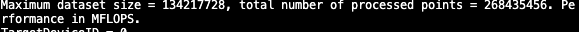
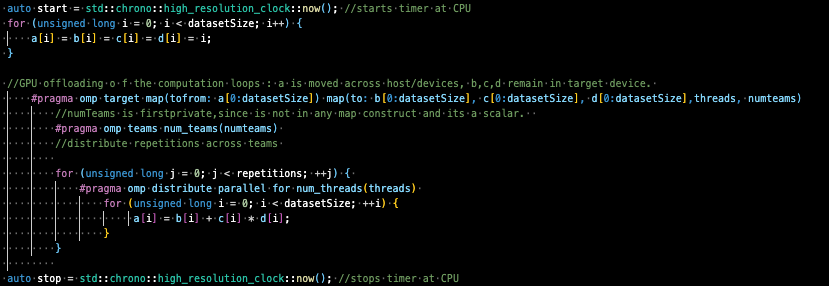
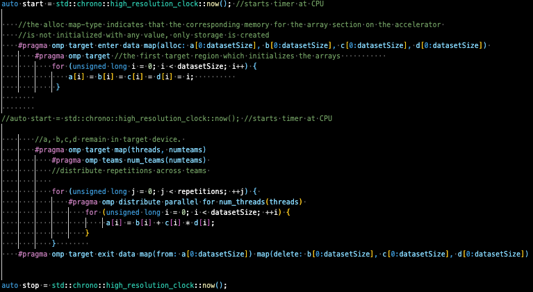

# Assignment 4 Report
Group: 104

#### Part I: Vector Triad

**1)** The `#pragma omp target` directive defines the target region in lines 31-37. When a host thread (thread in CPU) encounters the **target** construct, the target region is executed by a new thread running on the target device, which in our case is the GPU. The function `omp_is_initial_device()` returns true (1) if the current task is executing on the _host_ device; otherwise it returns _false_ (0). On the image below we can observe that `targetDeviceId` is initialized to 1 in the CPU, but when this block is called and print its value in the terminal, we notice that it changed to 0, meaning that this region was executed in another device. The logic behind this is that the **target** construct is a task generating construct. When a thread encounters a target construct a _target task_ is generated on the host device. This target task is a task bound to the host device that wraps the execution of the target region. The target task is complete **on the host** when the target region is complete **on the accelerator** (GPU). Therefore, for the systems we are working with (CPU and GPU), every time we want to offload the execution of certain code to an accelerator -GPU-, we can enclose it within a **target** region to guarantee its execution on such device. However, special attention needs to be paid to the variables needed in the target device, as we will discuss it later. 

**2)** For tasks 1.2 to 1.5 we set a constant number of threads, defined by the product of numTeams = 15 with num_threads = 32, which amounts to 480. 

      
    #pragma omp target map(tofrom: a[0:datasetSize]) map(to: b[0:datasetSize], c[0:datasetSize], d[0:datasetSize])
      #pragma omp teams num_teams(numTeams)
      for (unsigned long j = 0; j < repetitions; ++j) {

        #pragma omp distribute parallel for num_threads(numThreads)
        for (unsigned long i = 0; i < datasetSize; ++i) {
            a[i] = b[i] + c[i] * d[i];
        }
     }

We added the `distribute` construct in the  `pragma omp parallel for`, resulting in a composite accelerated worksharing construct. It distributes the iterations of the loop across two levels of parallelism. The first level is originated by the `target teams` construct, creating a league with 15 teams. Each initial thread in the league that encounters this last construct becomes the master thread of a team. The iterations of the i for loop are first distributed to the master threads. The subset of loop iterations assigned to the master threads are then again distributed to the threads in the team. In summary, we first create multiple thread teams executing in parallel, then we distribute the loop iterations to the teams and then to the threads in each team. 

**3)** In this task we decided to measure the execution time of the whole triad routine (i.e starting from initialization of the arrays) to use it as an criteria for performance, as well as the MFLOPS of the mere computation of A. For this, the changes can be found on the code . The table below depicts the changes mades for the two variants specified on the worksheet. Upper side displays the variant 1, with initialized vectors in CPU and then offloaded to GPU, whereas the lower column shows allocation and initialization directly in the GPU. 

| Variant 1                 |                 
| ------                    |                    
|  |  

|  Variant 2                |
|  -------------------------|
|  |

Using `target enter data/exit` constructs allows us to map variables in an unstructured way. These are standalone constructs that are not associated with a statement or structured block of code. When a host thread encounters the `target enter data` construct, a **map-enter** phase occurs for variables that appear in **map** clauses on the construct. We used the clause **alloc** to create storage in the GPU for each of the vectors without initializing them. Then we proceed with their initialization in another target region, however the data remains in the device environment. Similarly, a **map-exit** phase occurs for variables in map clauses on the `target exit data` construct when it is encountered. Since we only need the array a in the host, we added a mapping with clause _from_ to copy the computed a vector into the cpu, and we delete the remaining vectors since they are not necessary for the rest of the CPU routine. 

In **variant 1** we initialize the arrays in the CPU and then we map to the GPU domain. For **variant 2** we rely entirely on the GPU for allocation and initializatio, both taking place within the scope of a target region. We expected to observe a better performance for the second variant, however this was not easy to distinguis for neither of the two nodes, Thunder and Rome. The left graph shows the comparison between variants with respect to MFLOPS, and the right one displays the execution times for each of the variants.

