# Assignment 4 Report
Group: 104

#### Part I: Vector Triad

**1)** The `#pragma omp target` directive defines the target region in lines 31-37. When a host thread (thread in CPU) encounters the **target** construct, the target region is executed by a new thread running on the target device, which in our case is the GPU. The function `omp_is_initial_device()` returns true (1) if the current task is executing on the _host_ device; otherwise it returns _false_ (0). On the image below we can observe that `targetDeviceId` is initialized to 1 in the CPU, but when this block is called and print its value in the terminal, we notice that it changed to 0, meaning that this region was executed in another device. The logic behind this is that the **target** construct is a task generating construct. When a thread encounters a target construct a _target task_ is generated on the host device. This target task is a task bound to the host device that wraps the execution of the target region. The target task is complete **on the host** when the target region is complete **on the accelerator** (GPU). Therefore, for the systems we are working with (CPU and GPU), every time we want to offload the execution of certain code to an accelerator -GPU-, we can enclose it within a **target** region to guarantee its execution on such device. However, special attention needs to be paid to the variables needed in the target device, as we will discuss it later. 

**2)** For tasks 1.2 to 1.5 we set a constant number of threads, defined by the product of numTeams = 15 with num_threads = 32, which amounts to 480. 

      
    #pragma omp target map(tofrom: a[0:datasetSize]) map(to: b[0:datasetSize], c[0:datasetSize], d[0:datasetSize])
      #pragma omp teams num_teams(numTeams)
      for (unsigned long j = 0; j < repetitions; ++j) {

        #pragma omp distribute parallel for num_threads(numThreads)
        for (unsigned long i = 0; i < datasetSize; ++i) {
            a[i] = b[i] + c[i] * d[i];
        }
     }

We added the `distribute` construct in the  `pragma omp parallel for`, resulting in a composite accelerated worksharing construct. It distributes the iterations of the loop across two levels of parallelism. The first level is originated by the `target teams` construct, creating a league with 15 teams. Each initial thread in the league that encounters this last construct becomes the master thread of a team. The iterations of the i for loop are first distributed to the master threads. The subset of loop iterations assigned to the master threads are then again distributed to the threads in the team. In summary, we first create multiple thread teams executing in parallel, then we distribute the loop iterations to the teams and then to the threads in each team. 

**3)** In this task we decided to measure the execution time of the whole triad routine (i.e starting from initialization of the arrays) to use it as an criteria for performance, as well as the MFLOPS obtained from the sole computation of A. For this, the changes can be found on the code
 
. 

The table below depicts the changes mades for the two variants specified on the worksheet. Upper side displays the variant 1, with initialized vectors in CPU and then offloaded to GPU, whereas the lower column shows allocation and initialization directly in the GPU. 

| Variant 1                 |                 
| ------                    |                    
|  |  

|  Variant 2                |
|  -------------------------|
|  |

Using `target enter data/exit` constructs allows us to map variables in an unstructured way. These are standalone constructs that are not associated with a statement or structured block of code. When a host thread encounters the `target enter data` construct, a **map-enter** phase occurs for variables that appear in **map** clauses on the construct. We used the clause **alloc** to create storage in the GPU for each of the vectors without initializing them. Then we proceed with their initialization in another target region, however the data remains in the device environment. Similarly, a **map-exit** phase occurs for variables in map clauses on the `target exit data` construct when it is encountered. Since we only need the array a in the host, we added a mapping with clause _from_ to copy the computed a vector into the cpu, and we delete the remaining vectors since they are not necessary for the rest of the CPU routine. 

In **variant 1** we initialize the arrays in the CPU and then we map to the GPU domain. For **variant 2** we rely entirely on the GPU for allocation and initialization, with both taking place within the scope of a target region. We expected to observe a better performance for the second variant, however this was not easy to distinguis for neither of the two nodes, Thunder and Rome. The left graph shows the comparison between variants with respect to MFLOPS, and the right one displays the execution times for each of the variants. 

| MFLOPS                      |   Time (s)                  |               
| ------                      |  ------------               |                  
|     |         | 

Considering both nodes and taking the MFLOPS as the indicator for performance, we found two trends: for small to medium sizes, the CPU variant performs better than the GPU variant, but starting at 2^21, the GPU slightly outperforms the CPU variant. However, we need to consider that the performance obtained here was based on the mflops, which only considers the floating point operations and the execution time **after** the arrays have been initialized, and since for both variants the routine is executed on the same device, we cannot clearly infer that one variant is better than the other. Therefore, we complemented our inspection with our time analysis and there we found stronger differences. On both nodes, longer execution times were seen in the second variant, for all data sizes. For the first variant, the order was _initialize -> transfer data -> perform work_ ,whereas for the second, it was _allocate -> initialize data -> perform work_. One possible explanation for the increase in times is that the initialization of the arrays as a **sequential** routine is computationally more expensive than copying the initialized array. Although the memory bandwidth is higher in the GPU than in the CPU, the caches are considerable smaller, so one could attribute that many accesses to the memory in GPU will eventually cost more as size keeps increasing. 

**4)** We experimented with many loop scheduling policies (see assignment4_part_i_task1_4.cpp) including:
- #pragma omp distribute parallel for schedule **(static, 1)**, to enable memory coalescing
- #pragma omp distribute parallel for schedule **(static, 64)**
- #pragma omp parallel for (static,1)
- #pragma omp distribute parallel for

Only the relevant results for rome and thunder are shown below. For this task and 1.5a we decided to display the graphs using labels for the x-axis containing all data size values, to observe with more detail what happens with each size increment.

| Thunder                          |   Rome                         |               
| ------                           |  ------------                  |                  
|     |         | 

Looking at the OpenMP documentation, by default, when OpenMP, executing with T threads, encounters a parallel loop of N iterations, it assigns the first ceiling(N/T) iterations to thread 0, the second chunk of N/T iterations to thread 1 and so on. In our case, 15 threads ( i.e the master thread of each of the 32 teams) encounters this parallel region, so chunks are of size std::ceil(datasetSize / 15). At most **one chunk** is assigned to each team. Moreover, the `omp distribute parallel for` directive executes the loop using multiple teams where the loop iterations are distributed across the teams in chunks in round robin fashion. Each chunk forms a parallel loop, and the parallel loop is distributed across the threads that participate in the team region according to the clauses that apply to the omp parallel for directive, which, again, is static when no scheduler is specified. However, unlike the first variant, for this 5th case the chunk sizes are rather big, and considering that each team is integrated by a relatively small number of threads (32), we reduce the overhead of calling the threads several times one after  another albeit at the cost of not exploiting the memory layout. 

**With 15 teams and 32 threads per team, for Thunder, the best results are given by (static, 256) and for rome the best results are on (static, 16)** as seen in the graphs above. These results show that for the same number for teams and threads. The optimal chunk sizes varies greatly between the systems. This could be due to how powerful each of the individual gpu cores is and how fast they are able to go through each chunk with such a small number of assigned teams and threads. Given the numbers from the graph, GPUs on Rome seem much more powerful than Thunder's GPUs because they have higher performance. Rome uses small chunk sizes as the optimum here, which could mean that the memory for each gpu processing unit is small, thus each thread needs to have chunks close to each other, otherwise with larger chunks it would probably need to retrieve the data from a memory strucuture that is further away that causes increased memory retrieval time. Thunder on the other hand probably has higher cache type memory per GPU node, thus it can handle larger chunks although the performance of each compute node is lower. 

**5)** 
  
  a) We played with different schedules (static and dynamic) and chunk sizes, as it can be seen on the graphs below. For Rome, the most optimal configuration was **(static, 16)**, whereas for Thunder **(static, 256)** turned out to offer the best performance. For the following tasks we performed our experiments under these two configurations. 

|Thunder                              |   Rome                         |               
| ------                              |  ------------                  |                  
| 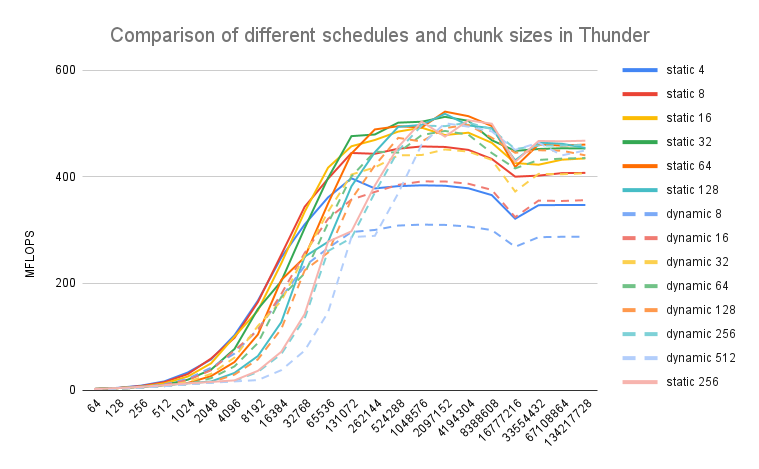     |       | 

  b) We set the numTeams to 1 and the number of threads as an argument, where numThreads is [32,64,128,256,512,1024,2048]. Running our experiments with the conditions described above, we observed higher number of MFLOPS for the last three values: 512, 1024 and 2048. Given that the differences amongst them were barely noticeable, we decided to take the MFLOPS average from the 10 largest datasetSizes. This results in **1024** threads per team as the optimal configuration for Rome, whereas for Thunder it is **2048**. 
  
|Thunder                              |   Rome                         |               
| ------                              |  ------------                  |                  
|      | 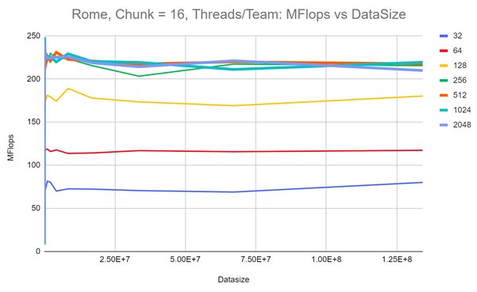 

c) 

|Thunder                              |   Rome                         |               
| ------                              |  ------------                  |                  
|      | 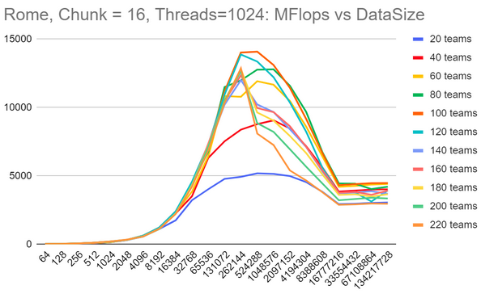 

**6)** 

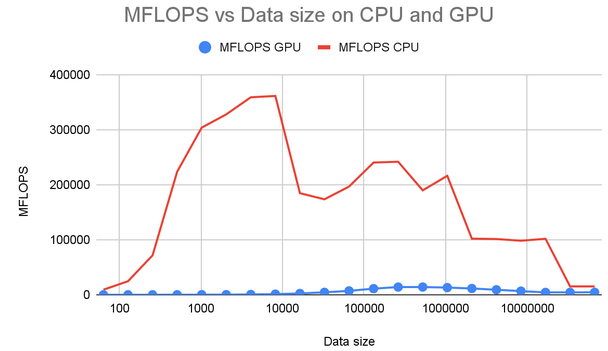

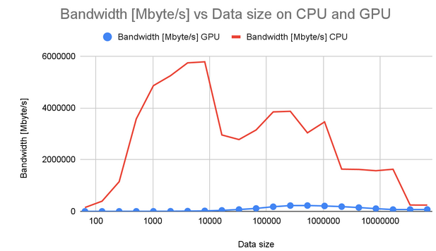

In the graphs above we see the performance of CPU versus GPU for the same triad calculations. The above CPU performance is with 64 threads, and (spread) type binding. The GPU calculations were done using 100 teams with 1024 threads each, with schedule(static, 16). All calculations were done on the Rome2 machine. 
   
Here, we notice that the cpu performance is much higher than the GPU on all data-sizes. The first reason for this is the extra time taken to offload the data to the GPU. All the data that has been initialized on the CPU memory has to be moved to the GPU data environment before processing can start. This is a very expensive operation and significantly lowers performance. However, it must be accounted for in the performance graphs since this is a necessary operation every time. Similarly copying data back to the cpu at the end of the calculations is also accounted for which doubles the time taken in just moving memory. This is one of the major reasons why performance on the GPUs is lower.

As we saw in assignment 1, the TRIAD calculation is only memory bound and not compute bound, thus the cpu performance was not a problem for this algorithm anyway. This means that moving to the GPU would not produce better results in terms of performance alone since memory transfer is the bottleneck and not a lack of parallel processing. The only thing the GPU actually added here was data transfer time, which again reduced performance.

Finally, till this question we were not running the 2 GPUs on the system in parallel. This would have theoretically cut the processing time and half and almost doubled performance as you will see in question 1.7. However, again this will not be enough to beat the CPU performance for this calculation.

**7)**

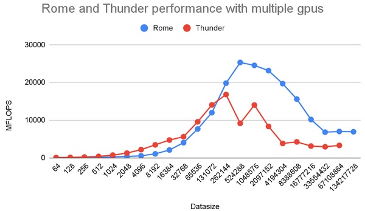

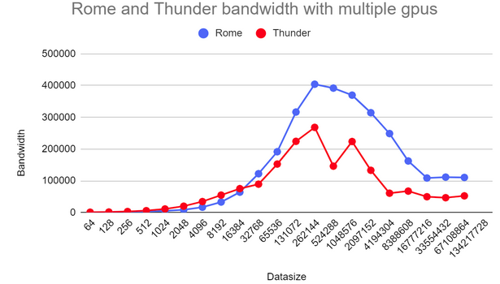

Above you can see the results from multiple gpus on each system with the best configurations for schedules, threads, and teams. Both graphs give almost twice the speedup as compared to a single gpu. Both the machines also showed peak performances at the same data-size i.e 262144. Rome is still faster than Thunder, even when compared at the optimum settings. It could be that the Rome system deals with data offloading from cpu to gpu better than thunder. This can be seen from the data sheets for the Rome GPU (https://www.amd.com/system/files/documents/instinct-mi100-brochure.pdf) which has 1.2TB/sec memory bandwidth as compared to Thunder GPU(https://images.nvidia.com/content/technologies/volta/pdf/tesla-volta-v100-datasheet-letter-fnl-web.pdf) which has 900GB/sec of memory bandwidth. However, overall for both systems we notice significant speedups from using multiple gpus in parallel.

#### Part II: Matrix Multiplication

#### Part 2: Matrix Multiplication

**1)** In line 33, it allocates array a, b and c of size ´data_size´ on gpu memory with ´omp target enter data´ clause, which only pass the data without any code. In line 35-37, it assignes number of teams and number of threads to be used for the following for loop. ´omp teams num_teams´ decides the total number of teams. ´omp parallel for´ in line 37 initiate parallelization. ´distribute´ clause let gpu distributes workload to the teams. Hence, the following for loop which initialize array a, b, c are parallelized on gpu. Now all arrays necessary for the matrix multiplication is already offloaded, therefore, in mm_kernel function, it calls target device and executes parallerized matrix multiplication. After the computation is done, it receives array a which contains the result of matrix multiplication from gpu with ´omp target exit data´ clause in line 60. Because only array a is necessary, it uses ´map(from: a[0:data_size])´ for array a, and release the other dynamically allocated arrays with ´map(release: b[0:data_size], c[0:data_size])´.

**2)**
We test the following tasks with two variants. The two variants have different matrix layouts, row-major and column-major. Since the matrix used in the code is an array which contains ´N * N´ data where N is the length of the matrix, we access each element either by ´N * row + column´ or ´N * column + row´. 

**variant 1**
In variant 1, both multiplicand B and multiplier C are in row-major layout, which means both matrix access the element by ´N * row + column´. This is the same access method as the original code.

**variant 2**
In variant 2, the multiplicand B is row-major layout, and the multiplier C is column-major layout. Therefore, we modified the index calculation method of C in initialization and matrix multiplication. The elements in C matrix are accessed by ´c[column * N + row]´ while B is accessed by ´b[row * N + column]´ in the initialization. Furthermore, the index of C matrix in the matrix multiplication is changed from ´c[TWO_D_ACCESS(j, k, N)]´ to ´c[TWO_D_ACCESS(k, j, N)]´. 

**(a)** cache blocking is applied to the matrix multiplication loops. Similar to the assignment 2, we defined ´TILE_SIZE´ and experimented with different size of tiles. The first three loops in matrix multiplication traverse over the tiles. Therefore, in each looo iteration, it add TILE_SIZE to the index to move to the next tile. The inner three loops traverse within tiles. Therefore, the index goes from 0 to TILE_SIZE in each iteration. Accordingly, the indeces of array a, b, c are modified. The image below is the code of variant 1 with cache blocking.

As seen in the figures below, significant differences are observed in the computations with large matrices. On Rome, variant 1 has a peak performance around the matrix size 750 to 1750, depending on the tile size. The performance decrease for the larger data size. However, the performance of the variant 2 reaches nearly the same performance with the variant 1 or even higher, and it keeps the performance level even for the larger matrix sizes. This is because for the small data size region, it is computer bound. therefore, both variants have the same performances. As the data size gets bigger, variant 1 misses cache because of its element access order. Hence, the performance of variant 1 decreased. Indeed the element accessing order of variant 2 is the best out of all the orders, and hence, it achieved better performance in memory bound region than variant 1. On Thunder, similar trend is observed for tile size = 5. However, the variant 1 is in fact better for tile size = 25. This is due to the cache size of Thunder. cache cannot store the large data size, so that it is missed in both variants, and resulted in low performance.

**(b)** We did experiments with static, dynamic, guided and runtime, and different chunk sizes for static and dynamic cases. The result is shown in the figures below. For both variants, smaller chunk size had better performance. Also both variants have the peak performance in the small matrix size region, and the performance decrease a little after the peak, and then it keeps the same performance level. Because some scheduling policies resulted nearly the same performances, we took the average of the performance over the matrix sizes, and decided the best scheduling policy. On Rome, static 1 and static is the most suitable for the variant 1 and 2 respectively. On Thunder, dynamic and static are the best choice for variant 1 and 2 respectively. As seen in the figures, chunk size affects the performance more than the type of scheduling policy since the same chunk size of static and dynamic poliyies are alomst identical.
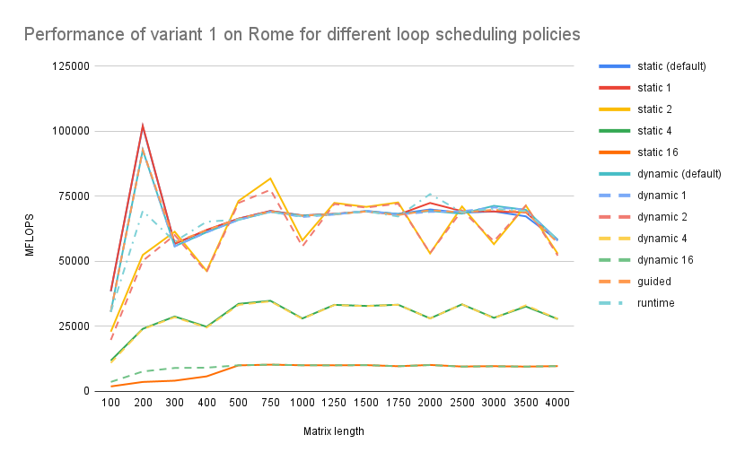
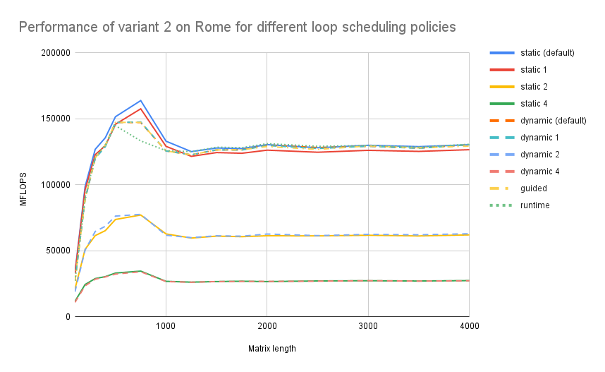
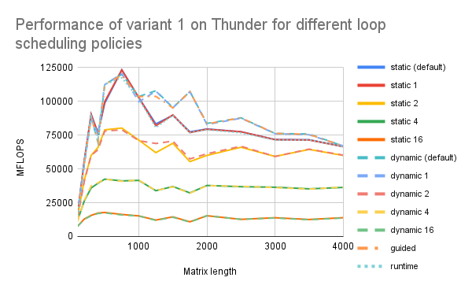
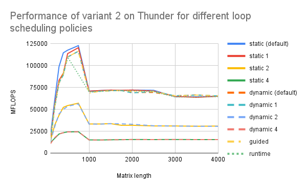

**(c)** Bandwidth are calculated as we did in the assignemnt 1, which is to multiply MFLOPS by a factor of 16. This is because we have 3 load and 1 store in each iteration, we multiply 4 by the size of the element of the arrays, which is 8 byte. Therefore, the bandwidth shown here are scaled version  of performance values. On Rome, it is clearly observed that at 200 matrix size the variant 1 reached its peak performance, and at 750 variant 2 reached the peak performance. the two variants stays the same performance level after thier peaks. On Thunder, we can see a different treand for variant 1. Its performance does not dramatically decrease like on Rome, but it stays as nearly the same performance level as the variant 2. However, on average, variant 2 performes better than variant 1 for both on Rome and on Thunder.
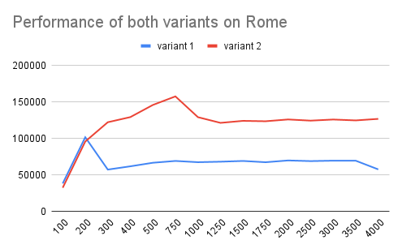
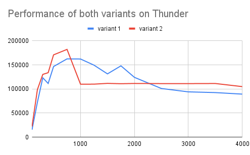
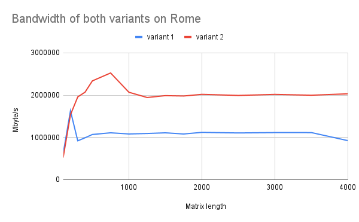
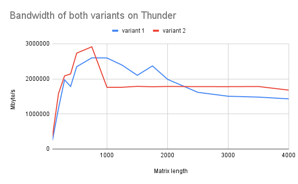

**(d)** From the results of assignment 2, we know that variant 2 is the most optimized version of element accessing. And it has 2 to 3 times higher performances than the element access order of variant 1. However, we did not observe the same degree of performance difference on gpu experiment. Especially, two variants almost performed the same on Thunder. One reason behind this result is, in the code, we measure the time spent on the matrix multiplication with chrono time. Since we need to offload the arrays to gpu before we run the matrix multiplication, we have to add start time before the offloading command. Therefore, the results are not purely the performance of matrix multiplications, but it includes the time spent on offloading. It affects the MFLOPS. In fact, the performances on gpu are not so different from the performance on cpu, even though theoretically they are significantly different. Hence, we can not fairly compare FLOPS of gpu version and cpu version. 

**2.3)**

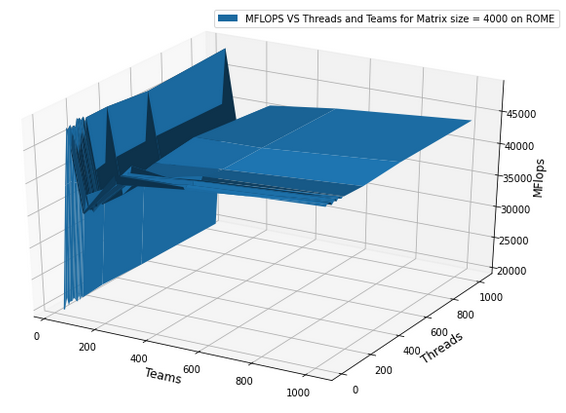

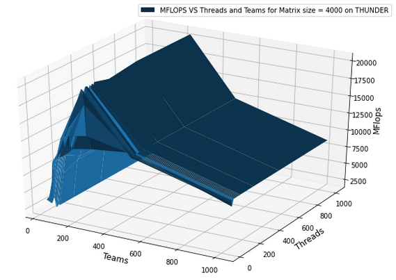

bove you can see the results of running the matrix multiplication program with a square matrix of size 4000. The optimum settings were variant 2 for both systems, schedules (static, 1) for rome, and (static) for thunder, both were initialized on gpu. The details of these configurations can be found in the answers above. It was noticed that Rome gave the highest performance of **49055.438 MFLOP/sec for Teams=80, and Threads=72, while Thunder’s best performance was 20670.808 MFLOP/sec for Teams=256, and Threads=128.**
Firstly, Rome has higher performance because its memory bandwidth is higher as explained before. We decided to take offloading time into account in the calculations as it is part of the work done to perform calculations on the GPUs. It is difficult to compare these two gpu systems due to the technology they use. However the data sheets are available here. 
ROME:  
(https://www.amd.com/system/files/documents/instinct-mi100-brochure.pdf)
THUNDER:
(https://images.nvidia.com/content/technologies/volta/pdf/tesla-volta-v100-datasheet-letter-fnl-web.pdf)

We can see that AMD has 120 “Compute Units” that give a performance of 11.5 TFLOPS on double floating point precision. NVIDIA has 640 “Tensor cores” that perform at 7TFLOPS on double floating point precision. Each of the AMD gpus can be assumed to have higher computational power, because it performs better with presumably less compute units. This is also the same pattern we notice in our own results obtained from the Rome and Thunder systems. Rome uses less threads in total than thunder. Here total threads are given by 

**Total Threads used = Teams*Threads per team**

Just by estimating from the 3d plots, at around 250 teams for Thunder and 80 Teams for Rome, there is an almost constant line, which shows us the optimum team size. Since a master thread in each team is responsible for dividing the work amongst other threads, this number for the master thread probably corresponds to a structure in the architecture, which groups hardware threads together. On this optimum team line, both systems behave similarly in that the performance keeps increasing as threads are increased for each team. Each thread also has memory coalescing to allow for reduced processing time. Since we used (omp distribute parallel for) it is likely that the round-robin execution is optimum for these numbers of team sizes on each system.

