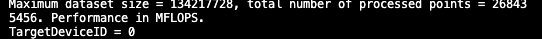

# Assignment 4 Report
Group: 104

#### Part I: Vector Triad

**1)** The `#pragma omp target` directive defines the target region in lines 31-37. When a host thread (thread in CPU) encounters the **target** construct, the target region is executed by a new thread running on the target device, which in our case is the GPU. The function `omp_is_initial_device()` returns true (1) if the current task is executing on the _host_ device; otherwise it returns _false_ (0). On the image below we can observe that `targetDeviceId` is initialized to 1 in the CPU, but when this block is called and print its value in the terminal, we notice that it changed to 0, meaning that this region was executed in another device. The logic behind this is that the **target** construct is a task generating construct. When a thread encounters a target construct a _target task_ is generated on the host device. This target task is a task bound to the host device that wraps the execution of the target region. The target task is complete **on the host** when the target region is complete **on the accelerator** (GPU). Therefore, for the systems we are working with (CPU and GPU), every time we want to offload the execution of certain code to an accelerator -GPU-, we can enclose it within a **target** region to guarantee its execution on such device. However, special attention needs to be paid to the variables needed in the target device, as we will discuss it later. 

**2)** For tasks 1.2 to 1.5 we set a constant number of threads, defined by the product of numTeams = 15 with num_threads = 32, which amounts to 480. 

      
    #pragma omp target map(tofrom: a[0:datasetSize]) map(to: b[0:datasetSize], c[0:datasetSize], d[0:datasetSize])
      #pragma omp teams num_teams(numTeams)
      for (unsigned long j = 0; j < repetitions; ++j) {

        #pragma omp distribute parallel for num_threads(numThreads)
        for (unsigned long i = 0; i < datasetSize; ++i) {
            a[i] = b[i] + c[i] * d[i];
        }
     }

We added the `distribute` construct in the  `pragma omp parallel for`, resulting in a composite accelerated worksharing construct. It distributes the iterations of the loop across two levels of parallelism. The first level is originated by the `target teams` construct, creating a league with 15 teams. Each initial thread in the league that encounters this last construct becomes the master thread of a team. The iterations of the i for loop are first distributed to the master threads. The subset of loop iterations assigned to the master threads are then again distributed to the threads in the team. In summary, we first create multiple thread teams executing in parallel, then we distribute the loop iterations to the teams and then to the threads in each team. 

**3)** In this task we decided to measure the execution time of the whole triad routine (i.e starting from initialization of the arrays) to use it as an criteria for performance, as well as the MFLOPS obtained from the sole computation of A. For this, the changes can be found on the code . The table below depicts the changes mades for the two variants specified on the worksheet. Upper side displays the variant 1, with initialized vectors in CPU and then offloaded to GPU, whereas the lower column shows allocation and initialization directly in the GPU. 

| Variant 1                 |                 
| ------                    |                    
|  |  

|  Variant 2                |
|  -------------------------|
|  |

Using `target enter data/exit` constructs allows us to map variables in an unstructured way. These are standalone constructs that are not associated with a statement or structured block of code. When a host thread encounters the `target enter data` construct, a **map-enter** phase occurs for variables that appear in **map** clauses on the construct. We used the clause **alloc** to create storage in the GPU for each of the vectors without initializing them. Then we proceed with their initialization in another target region, however the data remains in the device environment. Similarly, a **map-exit** phase occurs for variables in map clauses on the `target exit data` construct when it is encountered. Since we only need the array a in the host, we added a mapping with clause _from_ to copy the computed a vector into the cpu, and we delete the remaining vectors since they are not necessary for the rest of the CPU routine. 

In **variant 1** we initialize the arrays in the CPU and then we map to the GPU domain. For **variant 2** we rely entirely on the GPU for allocation and initialization, with both taking place within the scope of a target region. We expected to observe a better performance for the second variant, however this was not easy to distinguis for neither of the two nodes, Thunder and Rome. The left graph shows the comparison between variants with respect to MFLOPS, and the right one displays the execution times for each of the variants. 

| MFLOPS                      |   Time (s)                  |               
| ------                      |  ------------               |                  
|     |         | 

Considering both nodes and taking the MFLOPS as the indicator for performance, we found two trends: for small to medium sizes, the CPU variant performs better than the GPU variant, but starting at 2^21, the GPU slightly outperforms the CPU variant. However, we need to consider that the performance obtained here was based on the mflops, which only considers the floating point operations and the execution time **after** the arrays have been initialized, and since for both variants the routine is executed on the same device, we cannot clearly infer that one variant is better than the other. Therefore, we complemented our inspection with our time analysis and there we found stronger differences. On both nodes, longer execution times were seen in the second variant, for all data sizes. For the first variant, the order was _initialize -> transfer data -> perform work_ ,whereas for the second, it was _allocate -> initialize data -> perform work_. One possible explanation for the increase in times is that the initialization of the arrays as a **sequential** routine is computationally more expensive than copying the initialized array. Although the memory bandwidth is higher in the GPU than in the CPU, the caches are considerable smaller, so one could attribute that many accesses to the memory in GPU will eventually cost more as size keeps increasing. 

**4)** We experimented with four loop scheduling policies (see assignment4_part_i_task1_4.cpp):
- #pragma omp distribute parallel for schedule **(static, 1)**, to enable memory coalescing
- #pragma omp distribute parallel for schedule **(static, 64)**
- #pragma omp parallel for (static,1)
- #pragma omp distribute parallel for.

The results for rome and thunder are shown below. Only for this task and 1.5a we decided to display the graphs using an irregular x-axis containing all data size values, to observe with more detail what happens with each size increment.

| Thunder                          |   Rome                         |               
| ------                           |  ------------                  |                  
|     |         | 

Looking at the OpenMP documentation, by default, when OpenMP, executing with T threads, encounters a parallel loop of N iterations, it assigns the first ceiling(N/T) iterations to thread 0, the second chunk of N/T iterations to thread 1 and so on. In our case, 15 threads (the master of each team) encounter this parallel region, so chunks are of size ceiling(datasetSize / 15). At most **one chunk** is assigned to each team. Moreover, the `omp distribute parallel for` directive executes the loop using multiple teams where the loop iterations are distributed across the teams in chunks in round robin fashion. Each chunk forms a parallel loop, and the parallel loop is distributed across the threads that participate in the team region according to the clauses that apply to the omp parallel for directive, which, again, is static when no scheduler is specified. However, unlike the first variant, for this 5th case the chunk sizes are rather big, and considering that each team is integrated by a relatively small number of threads (32), we reduce the overhead of calling the threads several times one after  another albeit at the cost of not exploiting the memory layout. 

For Thunder, the 

**5)** 
  
  a)We played with different schedules (static and dynamic) and chunk sizes, as it can be seen on the graph below. For Rome, the most optimal configuration was **(static, 16)**, whereas for Thunder **(static, 256)** turned out to offer the best performance. 

 Thunder                          |   Rome                         |               
| ------                           |  ------------                  |                  
|     |         | 

  b) 

#### Part II: Matrix Multiplication

#### Part 2: Matrix Multiplication

**1)** In line 33, it allocates array a, b and c of size ´data_size´ on gpu memory with ´omp target enter data´ clause, which only pass the data without any code. In line 35-37, it assignes number of teams and number of threads to be used for the following for loop. ´omp teams num_teams´ decides the total number of teams. ´omp parallel for´ in line 37 initiate parallelization. ´distribute´ clause let gpu distributes workload to the teams. Hence, the following for loop which initialize array a, b, c are parallelized on gpu. Now all arrays necessary for the matrix multiplication is already offloaded, therefore, in mm_kernel function, it calls target device and executes parallerized matrix multiplication. After the computation is done, it receives array a which contains the result of matrix multiplication from gpu with ´omp target exit data´ clause in line 60. Because only array a is necessary, it uses ´map(from: a[0:data_size])´ for array a, and release the other dynamically allocated arrays with ´map(release: b[0:data_size], c[0:data_size])´.

**2)**
We test the following tasks with two variants. The two variants have different matrix layouts, row-major and column-major. Since the matrix used in the code is an array which contains ´N * N´ data where N is the length of the matrix, we access each element either by ´N * row + column´ or ´N * column + row´. 

**variant 1**
In variant 1, both multiplicand B and multiplier C are in row-major layout, which means both matrix access the element by ´N * row + column´. This is the same access method as the original code.

**variant 2**
In variant 2, the multiplicand B is row-major layout, and the multiplier C is column-major layout. Therefore, we modified the index calculation method of C in initialization and matrix multiplication. The elements in C matrix are accessed by ´c[column * N + row]´ while B is accessed by ´b[row * N + column]´ in the initialization. Furthermore, the index of C matrix in the matrix multiplication is changed from ´c[TWO_D_ACCESS(j, k, N)]´ to ´c[TWO_D_ACCESS(k, j, N)]´. 

**(a)** cache blocking is applied to the matrix multiplication loops. Similar to the assignment 2, we defined ´TILE_SIZE´ and experimented with different size of tiles. The first three loops in matrix multiplication traverse over the tiles. Therefore, in each looo iteration, it add TILE_SIZE to the index to move to the next tile. The inner three loops traverse within tiles. Therefore, the index goes from 0 to TILE_SIZE in each iteration. Accordingly, the indeces of array a, b, c are modified. The image below is the code of variant 1 with cache blocking.

As seen in the figures below, significant differences are observed in the computations with large matrices. On Rome, variant 1 has a peak performance around the matrix size 750 to 1750, depending on the tile size. The performance decrease for the larger data size. However, the performance of the variant 2 reaches nearly the same performance with the variant 1 or even higher, and it keeps the performance level even for the larger matrix sizes. This is because for the small data size region, it is computer bound. therefore, both variants have the same performances. As the data size gets bigger, variant 1 misses cache because of its element access order. Hence, the performance of variant 1 decreased. Indeed the element accessing order of variant 2 is the best out of all the orders, and hence, it achieved better performance in memory bound region than variant 1. On Thunder, similar trend is observed for tile size = 5. However, the variant 1 is in fact better for tile size = 25. This is due to the cache size of Thunder. cache cannot store the large data size, so that it is missed in both variants, and resulted in low performance.

