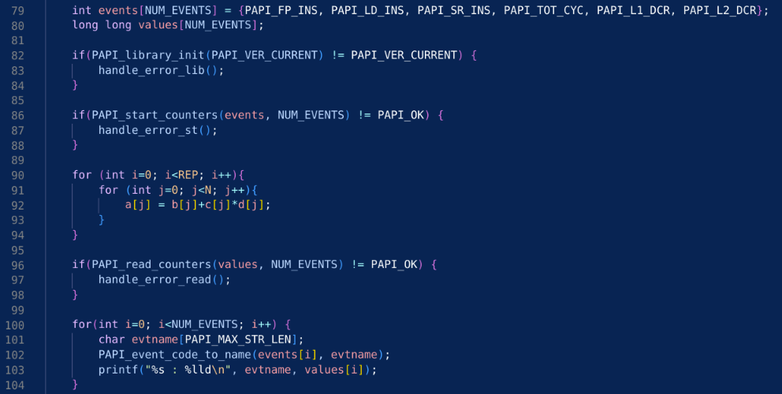
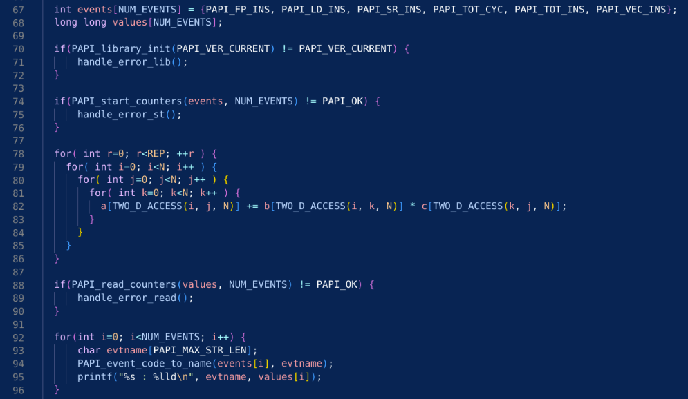

# Assignment 6 Report
Group: 104

**TODO@Students: Write your report in this folder using Markdown.**

**2)**
**(a)** For this taske, we tested with Rome2 and ThunderX2 machines. PAPI is enabled by commanding ´module load papi/5.7.0_rocm´ on Rome. On Thunder, firstly CUDA have to be loaded with ´module load cuda/11.1.1´ and then load PAPI with ´module load papi/5.7.0_cuda´. ´papi_avail´ command shows availability of PAPI commands. In this task, since we measure the CPU performance and memory bandwidth, we used following PAPI events:
 - PAPI_FP_INS (Floating point instructions)
 - PAPI_LD_INS (Load instructions)
 - PAPI_SR_INS  (Store instructions)
 - PAPI_TOT_CYC (Total cycles)
To apply PAPI for triad kernel, the commands written in the assignment 5 paper is added before and after triad for loops respectively as shown in the code snipets. Since only the main thread events are counted, opemMP parallelization is disabled. 

Performances are shown by running the code with flag ´-I $PAPI_INC -L $PAPI_LIB -lpapi´. The results from ThunderX2 id as below:

N = 32768, cycles = 32768
**MFLOPS (computed in assignment1) = 357.81**
**Bandwidth (computed in assignment1) = 5724.96**
| PAPI_FP_INS | PAPI_LD_INS | PAPI_SR_INS | PAPI_TOT_CYC |
| -----       | -----       | -----       | -----        |
|  2520184663 | 15032549735 |  2147549358 |  14692638462 |

using the number of instructions and cycles gained by PAPI, we calculated FlOPS and Bandwidth with the formulas below:

**MFLOPS = (PAPI_FP_INS) / (PAPI_TOT_CYC) * (CPU frequency [MHz])**

**Bandwidth[Mbyte/s] = ((PAPI_LD_INS) + (PAPI_SR_INS)) * (size of double) / (PAPI_TOT_CYC) * (CPU frequency [MHz])**

On Thunder, CPU frequency is maximum 2500 MHz, and minimum 1000 Mhz. Therefore, maximum and minimum MFLOPS, bandwidth are as follows:

|         | **MFLOPS** | **Bandwidth**|
| -----   | -----      | -----        |
|   max   |   428.82   |   23385.99   |
|   min   |   171.53   |    9354.39   |

MFLOS computed in assignment1 is within the range of MFLOPS calculated from PAPI, therefore, the two results correspond each other. However, Bandwidth from assignment1 is out of range of the bandwidth calculated from PAPI. 

**(b)** The same steps as task(a) are repeated here. The matrix multiplication code from assignment 2 is modified to be suitable for the experiment, and the PAPI commands are added as seen below:

The results from ThunderX2 is as below:

N = 1000, REP = 10
**MFLOPS (computed in assignment2) = 224.129**
**Bandwidth (computed in assignment2) = 3586.06**
| PAPI_FP_INS |  PAPI_LD_INS | PAPI_SR_INS | PAPI_TOT_CYC |
| -----       | -----        | -----       | -----        |
| 31793460505 | 220050050409 | 20020020187 | 223259694374 |

Again, the formulas are used to calculate MFLOPS and Bandwidth. MFLOPS and Bandwidth from PAPI are as follows:

|         | **MFLOPS** | **Bandwidth**|
| -----   | -----      | -----        |
|   max   |   356.01   |   21505.90   |
|   min   |   142.41   |    8602.36   |

Same as vector triad in (a), MFLOPS computed in assignment2 is within the range of MFLOPS from PAPI, hence it corresponds to it. However, the bandwidth calculated from PAPI is more than twice as large as the bandwidth computed in assignment2.

**(c)** From the experiments in task (a) and (b), we observed that FLOPS results from PAPI counter is corresponding to the results we got in assignment 2. However the bandwidth does not correspond for both triad and matrix multilplication cases. The reason we got got this difference is that the number of load instructions counted by PAPI is not as we expected. Theoretically, the number of load instructions both in vector triad and matrix multiplication must be three times larger than the number of store instructions because there are 1 store and 3 loads in each iteration. However, PAPI_LD_INS is about 8 to 10 times larger than PAPI_SR_INS. Therefore, we need to use another PAPI event which counts the number of load instructions as we expected. 

**3a)**

By running nsys nvprof, we get 4 tables as outputs. These tables give different information about the data communication between host and device such as the synchronous and asynchronous time to transfer data, the total memory used while copying, and the time taken to offload data. The first is the CUDA API Summary table from which we find the cuMemcpyHtoDAsync_v2, cuMemcpyDtoHAsync_v2, cuMemcpyDtoH_v2, cuMemcpyHtoD_v2. 

The cuMemcpyHtoDAsync_v2 and cuMemcpyDtoHAsync_v2 probably include the time for the actual calculations on the device as well because the kernels are executed asynchronously. They probably also include other tasks done such as the initialization tasks done for allocating data for the vectors, which were not counted in our own time calculations for the matrix multiplication. This is why these time values are so big. 

The time calculations in the same table received after synchronization through running cuStreamSynchronize shows much smaller results on cuMemcpyDtoH_v2, cuMemcpyHtoD_v2 because those are just the transfer times between HtoD (Host to Device) and DtoH (Device to Host). The times also agree in their values since 4 arrays are sent to the device and only one is returned; the times for these have corresponding durations. The table below is from the triad program run on the thunder system. It uses the assignment 4 code with variant 1, optimum settings for threads, teams, schedule on a single GPU.

Time(%) | Total Time (ns)  | Num Calls   |  Average         | Minimum  | Maximum       | Name 
 -------  --------------    ------------  ---------------     ---------  -----------    ---------------- 
2.0     | 1,103,078,185    |     110     |   10,027,983.5   |   6,155  |  133,354,885  | cuMemcpyHtoDAsync_v2 
0.7     | 391,789,930      |      44     |     8,904,316.6  |   31,370 |   191,003,830 | cuMemcpyDtoHAsync_v2
0.0     |      60,775      |      2      |        30,387.5  |  26,340  |       34,435  | cuMemcpyDtoH_v2
0.0     |      14,490      |      1      |        14,490.0  |   14,490 |        14,490 | cuMemcpyHtoD_v2

We see here that data transfer time between host and device plays a large part in the time taken to perform calculations. With just four arrays the impact was still small, but with many large data variables this time could have a much greater impact on the processing speed and should be accounted for in system performance metrics.

Running the ncu --metrics command with launch options we find how many teams and threads are actually launched on the gpu, compared to what we specified on the command line. 
These tasks for the triad code were run with the optimum teams (160) and threads(2048) used for the thunder system in assignment 4. However, since the Thunder system was not working the ncu-metrics were run on the IceLake system with the optimum settings from assignment 4 for the thunder system as instructed by the tutors. It was found that there are two omp_offloading that are run. One uses 160 teams, given by (launch__grid_size ) but only 128 threads per team (launch__block_size). This seems to tell us the upper limit of threads for each team on the IceLake system. Although the number of team values is close to the optimum for the thunder system, the number of threads per team is much smaller than expected. However, a comparison is still difficult since earlier assignment measurements were not made on this system. The other offloading is with 33 threads and 1 team which is presumably for something much smaller. It is unclear what these are for and the ncu --metrics results must be studied in detail to figure this out.

There is only one omp_offloading for the matrix multiplication. The results for the matrix multiplication program use launch__block_size = 128 threads per team again, but with launch__grid_size = 256 teams. For our settings we had specified Teams=256 and Threads=128 as optimum for the thunder system. It seems that the number of threads we specified were exactly equal to the number of teams and threads that were launched on  the IceLake system. This means that all the available threads in each team block that were launched by the gpu were completed. This means our metrics that were obtained from assignment 4 for the thunder system were also true for the IceLake system. However, proper testing must be done on the IceLake system to find the true optimum number of total threads.

These statistics seem to be quite helpful in understanding where the most time is taken in each gpu run and how many total threads are available to use. These statistics can be taken into account when trying to figure out how to optimize performance of certain code on these machines.

Data from all the tables for both the triad and matrix multiplication can be found in the metrics folder.

**3b)** 

From the rocprof Github (https://github.com/ROCm-Developer-Tools/rocprofiler) we find that the profiler gives the thread group count, which is the threads per team and the total thread count but not the number of teams. These values are specified by the columns (grd - the kernel's grid size, and wgr - the kernel's work group size). We find from the output of the ROME2 system with optimal settings obtained from experiments in assignment 4 that the triad program uses 256 threads, and 25600 threads in total i.e. 100 teams. We see that the total number of teams per thread that are launched are much less than the threads per team we specified, which were 1024 threads per team for the rome2 system. This is probably why in our results with a high number of threads, we got results that were very close together for very high thread numbers. We see here that the rome system launches twice as many threads as the IceLake system, but with fewer number of teams. These two things somehow balance out in the total number of threads. However, since the master thread for each team has less threads to handle in each block in IceLake, this means better distribution of work among them which is only limited by the performance of the threads themselves. 

Similar results are obtained for the matrix multiplication application with 20480 total threads and 256 threads per team or block. This means there are 80 teams. In our specification we chose only 72 threads for rome which is much less than the number of threads that were actually launched. This means we under utilized the system and we could have achieved better performance by reworking the code, maybe by initializing arrays differently or using a different schedule and chunk size or a more optimal work distribution between each master thread and the threads in each team. Thus more tests would need to be done in order to get closer to the number of threads being launched while increasing performance.

The resulting csv files that were obtained from the profiling can be found in the metrics folder.

**4a)**

From the results obtained for the IceLake machine, we find that the DtoH and HtoD times are very similar for both machines. 

**For the triad program:**
**IceLake:** cuMemcpyHtoDAsync_v2=972.05ms, cuMemcpyDtoHAsync_v2=379.22ms, cuMemcpyDtoH_v2=72.14us

**Thunder:** cuMemcpyHtoDAsync_v2=1.103ms, cuMemcpyDtoHAsync_v2=391.799ms,
cuMemcpyDtoH_v2=60.78us.

**For the Matrix multiplication program:**
**IceLake:** cuMemcpyDtoHAsync_v2 =236.14ms, cuMemcpyDtoH_v2=68.38us

**Thunder:** cuMemcpyDtoHAsync_v2=113.34ms, cuMemcpyDtoH_v2=60.06us.

This means that the gpus in both machines work very similarly. We notice that the numbers are similar almost everywhere except on the time to copy data from the gpu to the host again differs for the matrix multiplication program on the asynchronous version. This means the IceLake system either counts the asynchronous time differently, or probably that the setting chosen for threads and teams was not optimal causing more time to be taken to perform the calculation. Since, asynchronous time for data transfer takes into account these differences between threads or blocks of threads, the effect of these numbers can then be seen in the results for the memory transfer time. 

The files containing the results are stored in the metrics folder

####References:

1. https://indico.cern.ch/event/962112/contributions/4110591/attachments/2159863/3643851/CERN_Nsight_Compute.pdf
2. https://docs.nvidia.com/nsight-compute/ProfilingGuide/index.html#metrics-structure
3. https://forums.developer.nvidia.com/t/cudamemcpydevicetohost-200-x-longer-than-cudamemcpyhosttodevice/25011
4. https://docs.nvidia.com/nsight-systems/pdf/UserGuide.pdf
5. https://github.com/ROCm-Developer-Tools/rocprofiler

