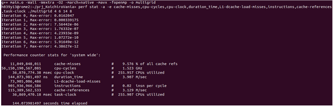

# Assignment 7 Report
Group: Group-104
Architecture: AMD Rome 

**Preparation for Profiling**

Perf was chosen as the profiler for this exercise. To get a quick overview of the hotspots we used `perf -record ./multigrid 4 6 14 8`, with compiler flags -O2, leading to the following profile.

As it can be seen from the above photo, the function _main_ and its call to _multigrid_ represent the biggest hotspot in the code. However, this profile doesn't provide a detailed view of the impact from other function calls due to inlining done by the compiler. Furthermore, references shown that on ISO C++, "GCC considers member functions defined within the body of a class to be marked inline even if they are not explicitly declared with the inline keyword", which is how the code skeleton was written. To override this behaviour we added the flag **-fno-default-inline** while compiling. Moreover, we decided to include the flag **-g** to enhance the debugging process, since it displays assembly code along with the corresponding c++ instruction. 

From this more detailed profile, we can concentrate on three targets: Jacobi::iterate, Prolongation::interpolation, and ComputeError::computePointwiseError. 

Lastly we ran `perf stat` to gather some information about the sequential implementation, specially duration_time. This was the basis for our performance, accuracy and speedup comparisons. Due to the statistical variance of the results, we assume the starting time to optimize to be _the average_ of five runs with the mentioned command, approximately 59 seconds.

            60,051.07 msec task-clock                #    0.999 CPUs utilized          
                6,166      context-switches          #    0.103 K/sec                  
                    0      cpu-migrations            #    0.000 K/sec                  
                46,028      page-faults               #    0.766 K/sec                  
     203,446,447,915      cycles                    #    3.388 GHz                      (83.33%)
        2,871,539,484      stalled-cycles-frontend   #    1.41% frontend cycles idle     (83.33%)
     123,537,407,766      stalled-cycles-backend    #   60.72% backend cycles idle      (83.33%)
     688,337,466,909      instructions              #    3.38  insn per cycle         
                                                    #    0.18  stalled cycles per insn  (83.34%)
        32,951,077,650      branches                  #  548.718 M/sec                    (83.33%)
            4,327,724      branch-misses             #    0.01% of all branches          (83.34%)

        60.119660362 seconds time elapsed

        59.076487000 seconds user
        0.942412000 seconds sys

**Coarsening**

We followed a heuristic approach, where we checked the sequential execution times with decreasing number of levels, mantaining the cycles, preSmoothing and postSmoothing constant. 

| # levels | nx,ny  | gridpoints | duration_time | max_error | 
| -------- | ------ | ---------- | ------------- | --------- | 
| 14       | 16383  | 268402689  | 58.5338062    |  4.39E-12 | 
| 13       | 8191   |67092481    | 13.97141131   |  1.97E-12 | 
| 12       | 4096   |16777216    | 3.515229679   |  1.19E-12 | 
| 11       | 2047   |4190209     | 0.894974802   |  5.42E-13 | 
| 10       | 1023   |1046529     | 0.227087144	 |  9.29E-13 | 
| 9        | 511    |261121      | 0.059950589   |  1.77E-13 | 
| 8        | 255    |65025       | 0.020617011   |  1.71E-13 | 
| 7        | 127    |16129       | 0.009326649   |  8.14E-14 | 
| 6        | 63     |3969        | 0.004818209   |  5.58E-14 | 
| 5        | 31     |961         | 0.003747507   |  1.65E-14 | 
| 4        | 15     |225         | 0.002477624   |  4.16E-15 | 

Surprisingly, reducing the number of levels seems to improve accuracy, whilst also reducing the execution time noticeably. From previous assignments one can notice that a safe choice for number of threads is to activate all available cores (physical and virtual), which in Rome amounts to 256 (128 physical). To avoid overhead and idle threads, we stop the parallelization when nx,ny = 15, meaning that the first 10 fine grids will be parallelized, whereas the remaining 4 will be solved sequentially. The implementation and results will be further discussed. 

**Parallelization**

We present the targets for optimization shown by perf (we omitted Restriction since it didn't have any representative effect on the performance):

| main.cpp                       | multigrid.h                    |
| ------                         | ------------------------------ |
|    | |

| Jacobi.h                       | Prolongation.h                 |
| ------                         | ---------------------------    |
|    |     |

| ComputeError                   | computePointwiseError            |
| ------                         | ---------------------------      |
| ||

**SIMD**

to enable auto-vectorization, `-O3` option is added. Also to obtain which loop is vectorized, `-fopt-info-vec` option is added.
We ran the following command on the originaly provided codes.

`g++ -Wall -Wextra -O3 -march=native -fopt-info-vec   -c -o main.o main.cpp`

and the output is as follows:

    Multigrid.h:70:34: note: loop vectorized
    Multigrid.h:70:34: note: loop versioned for vectorization because of possible aliasing
    Multigrid.h:70:34: note: loop vectorized
    Multigrid.h:70:34: note: loop versioned for vectorization because of possible aliasing

A loop in Multigrid.h, which initialize the fields, is vectorized.

'''
for (unsigned int i = 0; i < (_nxCoarseGrid + 2) * (_nyCoarseGrid + 2); i++)
{
    _coarseGridValues1[i] = 0.0;
    _coarseGridValues2[i] = 0.0;
    _coarseGridRhs[i] = 0.0;
}
''' 

Jacobi iteration, which is the bottleneck of the whole code, is not auto-vectorized. Therefore, we vectorized it with intrinsics. We used AVX from [intel intrinsics](https://www.intel.com/content/www/us/en/docs/intrinsics-guide/index.html#techs=AVX). AVX supports for 256-bit wide vectors. Since we deal with double precision values in Jacobi iteration, we use `__m256d` data type. Hence four double precision values can be processed at each loop. The remainders calculated sequencially. 

Comparison of elapsed time with/without SIMD (system wide elapsed time)

without SIMD:   59.873466658 seconds time elapsed
with SIMD:      50.077650654 seconds time elapsed
1.2 times speed up

(reference)
without auto-vectorization (use -O2 instead of -O3): 56.391031062 seconds time elapsed.

**Cache Optimization**

Cache Optimization: In this section of the optimization we attempted to improve the cache hits of the code. To start off we check the cache hits of the original code, which can be seen below:

We see from the output that only **3.388%** of all cache refs were misses, which is quite small. However, after optimizing the code with parallelization, compiler flags, and SIMD additions, the cache misses percentage jumped up to **13.606%** of the total, as seen in the picture below and it needed to be brought back down. The CXXFlags for the code below is: **CXXFLAGS = -Wall -Wextra -O2 -march=native -mavx -fopenmp**

To bring down the cache misses, we use the technique outlined in the hints part of the report. We set up the SIMD code in Jacobi.h so that there is a separate loop for the first two, y-loop iterations. The rest of the y-iterations are run separately. In the subsequent loop for iterations  y>2 we write code that allows the previous rows elements to be updated as well. Thus the values of y=1would be updated together with the values of y=3. Note that this means almost two times more calculations are being done in the Jacobi:iterate function. Here, we assume that at least some levels of caches are big enough to still have the storage locations of elements it accessed two rows before in the grid. This reasoning worked well and the results can be seen below.  The cache misses percentage is back down to 3.905% which is almost equal to the cache misses of the original unoptimized code. This is after having removed the parallelization from the Jacobi:iterate loops.

However, here we see that the extra code comes and cache optimization comes with the price of computation speed. The speed increased to 145.27 seconds from the run before which was 18.35 seconds. This is a huge jump in time.

Different parallelization and optimization combinations, along with compiler flags were tested to bring down the elapsed time. Some of them will be explained here.
Firstly, we tried the obvious technique of parallelization with 128 threads, which is the same setting used in the different files of the code. This resulted in a miniscule improvement in the time but with a three times increase in the cache misses. So this was ruled out as the right choice. This setting was tested with different thread numbers as well, for example threads=256, and threads=64. Threads=256 led to significantly fewer cache misses at 4.5%, while threads=64 led to 8% cache misses.  The result below is for 128 threads.

This leads us to believe that the number of threads is not the blockage to the run-time speed. Since we have 256 hardware threads on Rome (128 cores, 2 threads per core), and using double the threads from 128 to 256 did not give a higher speed, it means the blockage is either in the code or the memory. 

The point of cache optimization was to reduce memory retrieval time, so it is likely that bandwidth is not the cause of the problem.
Since our register sizes are only of size=4, meaning it can take 4 elements at once, which is good but still small, it is likely that this is causing a blockage in speedup. Doubling the calculations in every loop to allow cache optimization is the obvious culprit as well. It was expected that the error would be smaller with fewer ‘numberMultigridIterations’ being required if the previous y-2 row is updated in each row calculation but this causes a blockage. It could also be that since we are using multiple for loops in the code to allow for the cache optimization, each the threads wait at the end of each loop till they all finish, and start the next for loop. This re-syncing after each loop might be causing the significant blockage we see in the calculation time.  Restructuring the code to go over the grid differently or changing the structure of the loops or putting a no-wait clause might remove this blockage. 

A pragma omp nowait clause was then tested on both the for loops which go over y<=2 and y>2, with threads=256 and threads=128. This did not improve the time which remained at around 144 seconds. This leads us to believe that the additional code that is needed to be run here for cache optimization along with the extra for loops, cause the blockage in the run time of the code. The only possible solution would then be to improve how the grid is traversed in the Jacobi:iterate function to allow both speedup and cache optimization.

With parallelization in place, some of the other parameters we tested were compiler flags. We found that -O3 and -Ofast performs better than -O2 with the cache optimized code taking 134.29 seconds and 130.34 seconds respectively.  Both -O3 and -Ofast also give more cache hits than -O2, when parallelization is enabled. This is opposite to the case without parallelization. This could be because the additional flags in -Ofast and -O3 work better with parallel run code, than the flags in -O2. However, with all these flag choices the run time still remained in the range 140 seconds. 

In conclusion, with cache optimization the way it is implemented from the hints given, it is probably not possible to increase the computation time. The only solution we have in mind for this is to rewrite the Jacobi:iterate function to go over the grid in a different manner.

