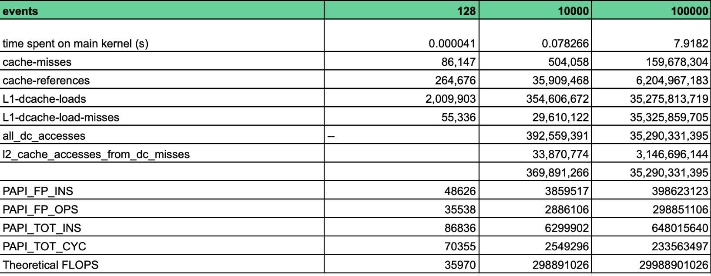

# Assignment 7 Report
Group: 104

Rome architecture: 
- 128 cores (256 virtual)
- L1D = 4.1943 MB 
- L2 = 67.1089 MB
- L3 = 536.87 MB
- 8 NUMA nodes

**a)** 

    
        for (int i=0; i<mlen-sublen; i++){ //row
       
            for (int j=i+sublen; j<mlen; j++){ //column
                if (i!=0) 
                    QT[j-i-sublen] += df[i] * dg[j] + df[j] * dg[i]; (I)

                 double cr = QT[j-i-sublen] * norm[i] * norm[j];
                 if(cr > mp[i]){ (II)
                   mp[i] = cr;
                   mpi[i] = j;
                }
                if (cr > mp[j]){ (III)
                   mp[j]=cr;
                   mpi[j]=i;
                }
            }
        }

In this case, in order to advance to the next row, (i.e an increase on i), we need the values computed in the previous row. Looking at instruction (I):

i, **j = i+sublen** (row i)
- QT[(**i + sublen**) - i - sublen] = QT[j - i - sublen] + df[i] * dg[j] + df[j] * dg[i];
- _QT[(**i + sublen** + 1) - i - sublen]_ = QT[(**i + sublen** + 1)  - i - sublen] + df[i] * dg[j+1] + df[j+1] * dg[i];
- QT[(**i + sublen** + 2)  - i - sublen] = QT[(**i + sublen** + 2) - i - sublen] + df[i] * dg[j+1] + df[j+1] * dg[i];
. 
. 
. 
- QT[(**i + sublen** + (mlen - sublen - i -1)) - i - sublen] = QT[(**i + sublen** + (mlen - sublen - i -1)) - i - sublen] + df[i] * dg[j+(mlen-1)] + df[j + (mlen-1)] * dg[i];

i+1 (next row)
- QT[(**i + sublen + 1**) - (i + 1) - sublen] = QT[(i + sublen + 1) - (i + 1) - sublen]+ df[i+1] * dg[j)] + df[j] * dg[i+1]; 
- _QT[(**i + sublen + 1** + 1 ) - (i + 1) - sublen]_ = _QT[(i + sublen + 1 + 1) - (i + 1) - sublen]+ df[i+1]_ * dg[j+1] + df[j + 1] * dg[i+1]; 

This requires synchronization of QT, since cr, which is proportional to QT, is a parameter used to determine the distances and indexes to be assigned. One alternative would be to compute partial row and cr values (i.e one thread per row), with row 0 being broadcasted, and synchronize in an ordered way their values (see STOMP implementation, which buffers intermediate results). As mentioned in the lecture, the outer loop (rows) is suitable for threading, whereas the inner loop, due to the comparisons and store operations needed, is more suitable for single instruction, multiple data model. 

We start our optimized code by making use of #pragma omp simd, which divides the loop iterations into chunks that fit in a SIMD register (see main_simd.cpp). For AMD, AVX registers can store up to 256 bits (4 Double or 8 Single precision). 

With these vectors, we can compute local values for cr. This is feasible because at (II) mpi[i] and mp[i] will end up taking the maximum value of cr along j (columns) and the corresponding j (so only two store operations will be needed for the entire execution of the j loop, one for the index and one for the distance). Hence, by computing local maximums of cr and then finding the global maximum (of the ith row), we can then update the values at position i. 

`mp[i] = max(cr_1, cr_2, cr_3) ` where cr_n represents the local maximum of vector n. 

   
    
        #pragma omp simd reduction(maximo:maxStruct)
	        for (int j=i+sublen;j<mlen ;j++){
          

Since we need to update both the index and the distance, we create a struct that stores these two elements for each vector. 

        struct MyMax {
         double max_cr;
        int idx;
        };

We then implemented an user-defined reduction, which operates with struct MyMax datatypes, returning the struct with the highest cr. 

        #pragma omp declare reduction(maximo : struct MyMax : omp_out = omp_out.max_cr > omp_in.max_cr ? omp_out :omp_in)initializer(omp_priv={-1.0, -1})

To find the local max_cr: 

         if (cr > maxStruct.max_cr ) {
		    maxStruct.max_cr = cr; //assign cr to local maximums 
                    maxStruct.idx = j;		    
		        } 

Lastly, check if the selected maximum is higher that the current value 

        if (maxStruct.max_cr > mp[i])
      {
        mp[i] = maxStruct.max_cr; //ONCE YOU HAVE COLLECTED ALL LOCAL MAXIMUMS, Perform reduction AND ASSIGN IT 
        mpi[i] = maxStruct.idx;
      }

Due to the limited events available within each profiling tool, we conducted a multi stage process to obtain number of FLOPs, execution time , memory events and number of instructions, within the main loop scope:

1) include a function to obtain the execution time of the code using two timers place at the begin and end of the main loop and compute their difference.  

        double get_curr_time(){
             struct timespec t;
             clock_gettime(CLOCK_MONOTONIC, &t);
             return t.tv_sec + t.tv_nsec * 1e-9;
         }

2) use _perf -stat_ with the following events:
        - cache-misses
        - cache-references
        - L1-dcache-load-misses
        - L1-dcache-loads
        - ls-dc_accesses
        - all_dc_accesses
        - l2_cache_accesses_from_dc_misses

3) run _perf -report_ with the mentioned events to detect hotspots.

4) in a second copy of the respective implementation, add PAPI High Level subroutines for error handling and variables to initialize counters for PAPI default events (cycles, floating point operations / instructions, instructions, clock):

        void handle_error(int i){
        printf("Error while configuring PAPI");
        exit(EXIT_FAILURE);
        }

        ...//some code
          auto retval = PAPI_hl_region_begin("computation");
                if(retval != PAPI_OK) {
                 handle_error(1);
                }
        //beginning of for loop

        //end of for loop
        retval = PAPI_hl_region_end("computation"); 
  
        if ( retval != PAPI_OK ){
                handle_error (1);
                }

**sequential implementation without optimization flags**

**sequential implementation with optimization flags**

**pragma omp simd reduction**

**c)**
**Multi-threading - OpenMP:**
For the blocking part, our initial approach was to try and follow the approach from the hints section of triangular tiling. Even though this did not work out for us, the approach is worth explaining briefly. The idea was to simply divide the original triangle matrix into 4 smaller ones. Since the mp and mpi vectors need the highest results for each row and column the results from the 4 smaller triangles can be compared at the end to find the highest results. This division of a triangle into 4 smaller ones could then be done recursively as needed. 
However, during the implementation, the QT vector kept causing problems. The QT vector is updated in such a  way that results from the previous row at the node one before the current one on the current row, is updated at the same position in QT. This update causes problems in implementing  the tiling. We tried different methods to get around this problem such as exchanging the row and column loops to traverse the matrix in a less inter-dependent manner. We also tried to avoid this problem using openmp pragma directives such as pragma omp atomic. Unfortunately, since the way QT is updated, the previous rows results affect the current row, an algorithm to implement the tiling while accounting for this could not be developed in time that does the tiling as is suggested in the assignment. 

Another tiling method was implemented, that simply divides the rows and columns into smaller blocks. The smaller blocks are then traversed serially as if it was a normal matrix and only the iteration operations then need to be adjusted. One such condition for the column loop was that its needs to start at the initial point of the column block outer loop, but should only update the QT vector when the column loop **(j)** is **>=** the row loop **(i)** plus the sublen variable, as was the case in the original main loops.
However, only the row block **(i)** loop was added to one of the final versions of the code. This is because again we could not find a way to parallelize this implementation without using private variables to make copies of the arrays, which for large array sizes in the millions, would be a huge waste of resources and not be efficiently parallel. Adding a row blocking loop to the final version of the code is just to show that it is possible to do it in a certain sense, however it is not a perfect implementation. All three code versions will be included in the submission for reference. Next we move to parallelize the code using openmp, thread pinning and numa configuration.

We start off by adding openmp pragmas to all loops where it’s possible.Starting off simply by choosing the input len=102400 and sublet=10. With schedule static, we test different thread counts and check the MFLOPS for each of them, a graph for this can be seen below.

The MFLOP count for the graph above is obtained using the papi profiler. However, we also computed the MFLOP count by hand and got similar results. The formula for this is given below 
**Total runs of nested loops: 946018475 (obtained using a count iterated variable)**
**mlen-sublen: 102381**
**Total operations: 6*(946018475-102381)+(2*102381)        (where 6 is the total count of arithmetic floating point operations and 2 is the operations done when i=0)**

We see that most of the results are fairly close to each other, except for threads=4 and threads=8. It's possible here that the data is  non optimally distributed which causes hindrance during memory retrieval and calculation time across the threads, for this datasize, resulting in this performance slow down.
Next we checked different schedules such as dynamic and unspecified schedules across the best results in the graph above, but the results did not vary much. 

The next step taken was thread pinning to avoid costly memory access. We first started by using **Aligned_alloc** instead of malloc while declaring variables to keep their memory locations tightly bound. We then tried different combinations of thread pinning. Since with large data sets the memory will be spread out it is better to use **OMP_PLACES=cores** **OMP_PROC_BIND=spread** to place a thread on each core and spread the spreads while setting thread count =128 which is equal to the number of cores this way there is an average of how quickly memory can be reached and since the thread count is equal to the cores there is not wait time to load or store from the cache directly associated with the cores. We also tried **OMP_PLACES=threads OMP_PROC_BIND=close and OMP_PROC_BIND=true** because we have defined **Aligned_alloc** previously keeping threads close together allows quick retrieval of data nearby with each thread having access to data nearest to it only. Other combinations were also tested, however there was minimal improvement in the computation time. The obvious reason for this should be that the main computation loops are not using parallelization because of the difficult way they have been defined. However they are using SIMD registers and -O3 auto vectorized compiler optimizations which greatly bring down the computation time from its original run time of around 75 seconds to just around **6.5 seconds**, when the len=102400

Finally we tested NUMA configurations. When using threads, we initialized the data in the same way that it was gonna be accessed later by adding #pragma omp parallel for schedule(static). Since the NUMA nodes define a unit of computation and memory of sorts, they play a major part in memory retrieval and computation time. The **AMD ROME system has 8 NUMA domains**, and retrieving memory from one domain to another causes varying amounts of time on the computer depending on how far the other NUMA is. Here we used **numactl --cpubind=1 --membind=0,1,2** for example which runs the program on cpu 1 and distributes the memory of the program to NUMA domains 0,1, and 2. This way the cpu should have very fast retrieval of data from memory. Coupling this with the right thread pinning can give maximal results. An example result is shown below which shows the time elapsed at approximately 6.42 seconds to run a code with **len=102400**

In conclusion SIMD intrinsics, compiler flag optimizations, memory alignment, thread counts and pinning and effective use of numa architecture can give optimal performance results. However, without a significantly parallelized code the performance gains reach a bottleneck. It is possible to increase the computation speed by declaring many of the arrays as private variables in the main computation loops, but in the real world with much larger arrays such a trick would not be wise and would not give optimal performance. Hence, here it is better to use the other features mentioned above to improve the performance as much as possible. With more time available it would definitely be worthwhile to properly parallelize the main computation loops.

# References
1. https://hpc-wiki.info/hpc/Binding/Pinning
2. http://www.hpc.acad.bg/numactl/

